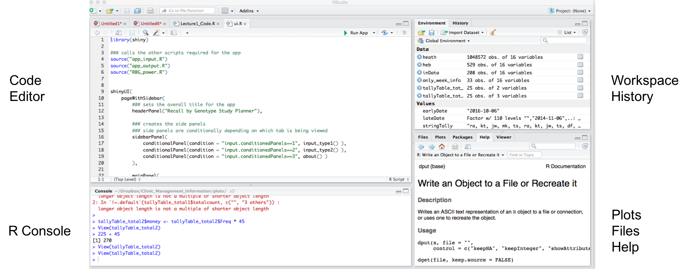
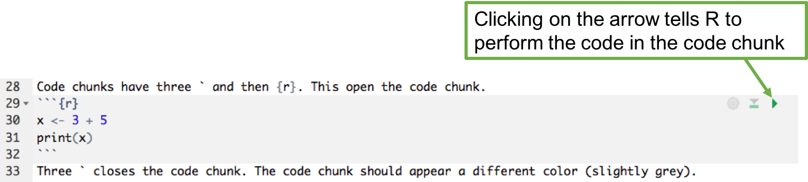
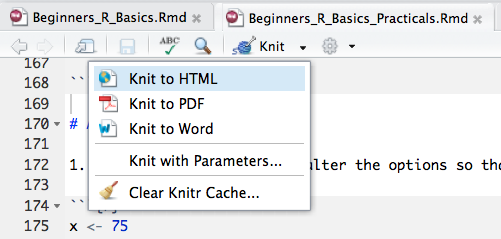
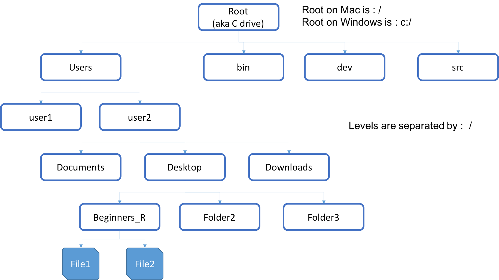
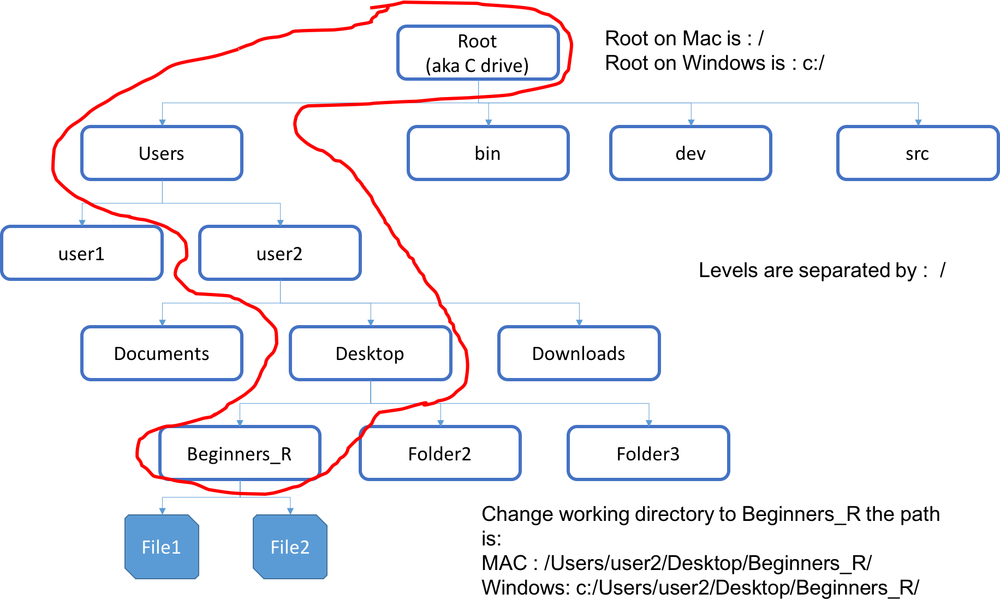
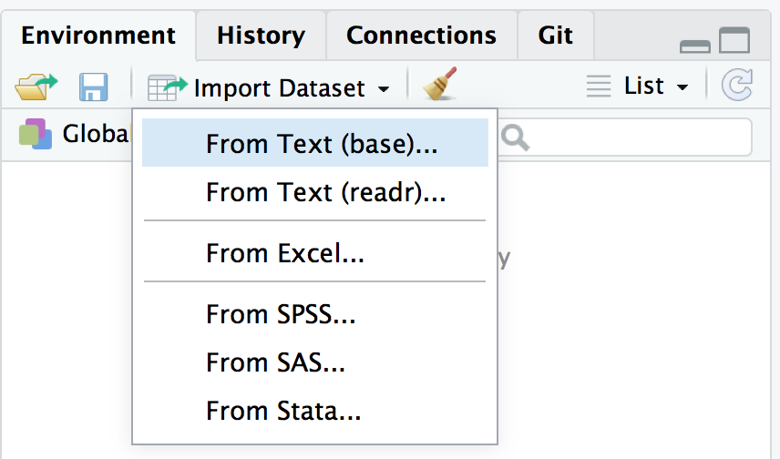
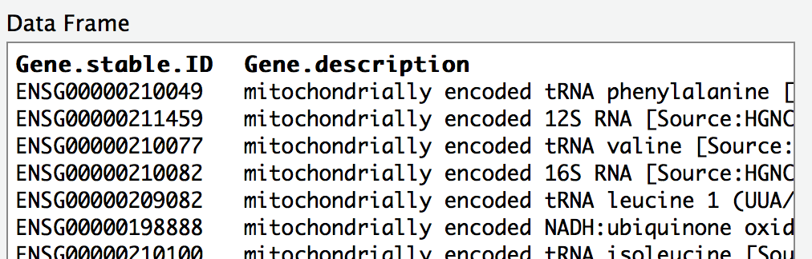
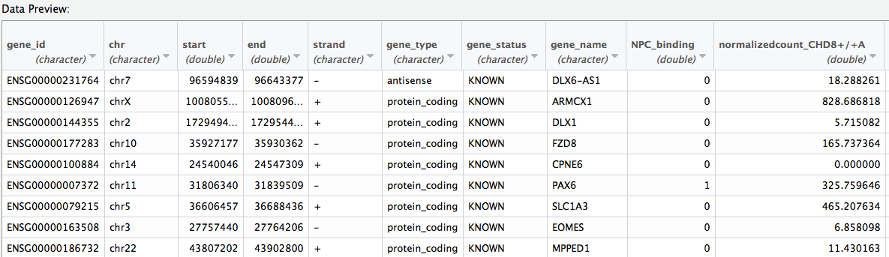
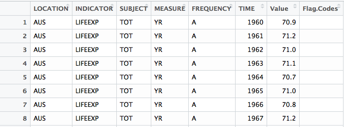
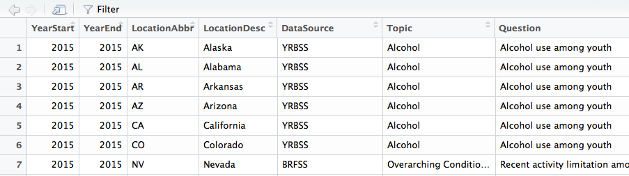

# SETUP

The data was sent to you before the course.   

Please **place this file on your desktop** and **unzip** it.

We are going to be working on **2** files. Please open:       

    1. Beginners_R_Basics_Practicals.Rmd          
    2. Beginners_R_Basics.html            
    
Beginners_R_Basics.html is a *html file*, and should open in your default internet browser. 

Beginners_R_Basics_Practicals.Rmd is a *R markdown file*, and should have opened up in RStudio.     

## Output in RStudio 

We need to alter how the output is displayed for *Beginners_R_Basics_Practicals.Rmd* in RStudio.    

We want the output to be displayed in the console **NOT** within the R markdown file.      

To change this:

    Click on the Gear Icon > Select "Chunk Output in Console" 
 
  

## Reveal the Table of Contents 

*Beginners_R_Basics_Practicals.Rmd* has a table of contents created using the **#** which creates headers in Markdown.   

To access this: press the dashed line button on the upper right corner of the markdown file.


# Aim of the workshop	

* Basics of R
* R Markdown
* Importing/Exporting data
* Working with R packages
* Data wrangling using the tidyverse package
* Data visualization with ggplot2

# Basics of R

## Learning Objectives

* Get familiar and comfortable with RStudio and Rmarkdown  
* Understand the basic syntax of R  
* Know the different data types and structures used by R  
* Learn where to find help   
* Find and install packages into R
* Import and Export data from R

# R Studio


     
<br>
<br>

You should **ALWAYS** write your code into a script that you save.

This will help avoid having to re-write code that you have already written, saving your self time and energy.

Helps make all the analyses you produce *reproducible*, which is **essential** for all scientific research.

It is worth noting that some journals have started to ask for code submission along side papers to make the data and results within publications as transparent as possible. Get into the habit now to write and save scripts.      

      

<br>

> Let's open an R script now

Open a new R script

    Go to File > New File > R script     

     

<br>    

# How to work with the practicals? 

The practicals (*Beginners_R_Basics_Practicals.Rmd*) are written using R Markdown, which we will talk about in detail later. 

> Look at *Beginners_R_Basics_Practicals.Rmd*    

        


## Install R Markdown packages

For the moment the simplest way to do this is to open a new Markdown file which will prompt you to add the required packages if necessary. 

To open a new Markdown file:

    Go to File > New File > R Markdown...     

      

<br>

*If this prompts you to install packages, **click yes***

This will open a dialogue window, **click CANCEL**.      

# Do math
Very basic use of R is getting R to perform mathematical operations. 

Click the green arrow on the right hand side to run this code in the practical markdown.  

```r
2 + 2
```


```r
5 - 3 + 2 * 4^2
```


```r
11465 * 2358971436
```


```r
options(scipen = 999)
11465 * 2358971436
```
What is the difference between these last two runs?    
**What do you think *options(scipen = 999)* is doing?**      

<br>

Some examples of mathematical operations:

Action                                          | Symbol       
------------------------------------------------|--------------------------------------          
Addition                                        | +       
Subtraction                                     | -     
Multiplication                                  | *            
Division                                        | /      
Exponentiation                                  | ^       
Modulo (remainder of the Euclidean division)    | %%        
Trig functions                                  | sin(), cos(), tan(), acos(), asin(), atan()       
Natural log                                     | log(), log10(),  log2()      
Exponential                                     | exp()      
Absolute Value                                  | abs()      
Square Root                                     | sqrt()             
Rounding                                         | ceiling(), floor(), round()          

See [here](http://adv-r.had.co.nz/Vocabulary.html) for more basic math functions built into R.    

> Do some mathmatical operations in R     

*Complete these in Beginners_R_Basics_Practicals.Rmd*

1. What is 2 to the power 16?

```

```

2. How many seconds are in a day?

```

```

3. What is 150 pounds in kilograms? (1 kg = 2.20462 pounds)

```

```  

# Prompt   
The prompt is represented by this symbol **>**. This means that R is **awaiting input** telling you that **nothing is currently running**.    

When a line of code is not properly formatted, R will "hang", and this symbol **+** will be at the start of the line. 

This means R is waiting for the command to be completed/correctly formatted. 

When this happens, the command sometimes will need to be "killed" in order to get the input prompt back.     

**To get back to the input prompt (>) for R, hit ESC**         

If you do not see **>** or **+**, this implies that R is running the previous command submitted.     

<br>
Click the green arrow to run this code in *Beginners_R_Basics_Practicals.Rmd*.       

```r
5 - 3 + 2 * 4^
```

Click the green arrow on the right hand side to run this code in *Beginners_R_Basics_Practicals.Rmd*.  

```r
(4 * (5 - (3 + 1))
```

# Comments
R ignores everything after a **#**.   

Use these to make comments in the code.   
 

```r
# comments start with a hash just like UNIX
# these are not evaluated in R
# calculate rate of change
45/100
```

```
## [1] 0.45
```

Commands can come after the command on the same line as well. 

```r
43 # a number
```

```
## [1] 43
```

```r
"hello" # a word/character
```

```
## [1] "hello"
```

# Assigning values to variables

A variable stores a value or an object.    

Use variable’s name to easily access the value or the object that is stored within this variable.    


```r
x <- 43 
y <- "hello"  
```
Variable names **can not** contain spaces or special characters. They also **can not** start with a number.   

    <- used to assign values to variables

The symbol is a *less than* follow by a *dash* :  <- 

<br>

*Good style practice* : Space out your code! 
    

```r
# No spaces
x<-4+5/6*4

# With spaces
x <- 4 + 5 / 6 * 4
```
It makes it easier to read/digest when it is spaced out.   

Here are two R style guides which covers things like file names, variable names, assignments, spacing, syntax, etc. One from [Google](https://google.github.io/styleguide/Rguide.xml) and one from [Hadley Wickham](http://adv-r.had.co.nz/Style.html).        

<br>

You can also use **=** for assignment, but it is better to use the **<-** rather than **=**.   

However, there is a difference in their behaviour which is to do with scoping and environments in R.    

It is better to use **<-** for assignment to avoid any potential future issues.     

<br> 

**Best practice:**     

* Make the variable names meaningful         
* Do not make them too long            

There are a variety of different types of variable naming conventions:          

    this_is_called_snake_case     
    whileThisIsCamelCase       
    sometimes.there.are.periods      
    Or_thereAre.thoseThat_Annoy.everyone     
    
For best compatibility with other program (like Python), don't use *sometimes.there.are.periods* as this can interfere with Python's dot notation.       

> Assign values to variables     

Create a list of different animals (barnyard and household animals) each with a different value. Create at least 7 variables. 

```
```

# Variables can be used like values
Use variable name instead of values to perform mathematical operations, or any operation in R. R will replace the variable name with the value it represents.    
  

```r
farmyard <- horses + ...
farmyard
```


```r
household <- dogs + ...
household
```

> Perform other mathematical operations with variables created

1. Get the ratio of household to farmyard animals

```
```

2. Get the difference between household and farmyard animals

```
```

# Displaying values of variables

There are two ways to do this:

1. Type the variable name into the R console

```r
dogs
```

2. Use **print()** function, either in a script or in the R console

```r
print(dogs)
```
*Do not use print if you have a lot of data.*    

This will print all the rows and columns in the dataset to the screen and if you have a few thousand rows or columns it is really pointless.  

## Tab Completion

RStudio will tab complete previously defined variable names and also commands!

This can be **very useful**, particularly for long or complicated variable names which are harder to get wrong if R is helping you complete the name. 

*Remember with computers: You **MUST ALWAYS** be completely precise in your instructions*

# Data Types
Not all data are the same. R treats data differently depending on what type of data it is.            

Types data in R:          

Type                        | Example          
----------------------------|--------------------------------------------         
Character                   | "words", "strings of words", "a", "abc"          
Numeric (real or decimal)   | 1, 23.25       
Integer                     | 2L        
Logical                     | TRUE, FALSE        
Complex                     | 1+4i        

The L after the number in the integer tells R that this is an integer. Integer is a subclass of numeric. Sometimes the double class is also used, which is also a subclass of numeric.  Complex is for complex numbers with real and imaginary parts.       

To determine what type of data something is you can use the **class()** or **typeof()** function. These give you slightly different information.                  
 
Variables inherit their class from the value or object assigned to that variable.   


```r
x <- 3
y <- "cars"

class(x)
```

```
## [1] "numeric"
```

```r
class(y)
```

```
## [1] "character"
```

```r
typeof(x)
```

```
## [1] "double"
```

```r
typeof(y)
```

```
## [1] "character"
```

# Getting Help
There are various ways to get help in R.    

When you know the exact name of the function : ?function_name, help(mean)     
When you don’t completely remember the function name : ??function_name   

Let's see how to get help for the mean function in R (**mean()**).

1. Go to the help tab in RStudio in the bottom right quadrant, and type the function name into the search box    

2. Use **?**

```
```    

3. Use **??**

```
```   

4. Use **help()**

```
```

Also Google it. These are the results from googling [R mean help](https://www.google.co.uk/search?q=R+mean+help&oq=R+mean+help&aqs=chrome..69i57j0l4.1679j0j7&sourceid=chrome&ie=UTF-8) 

**THE INTERNET IS YOUR FRIEND**

[Quick-R](http://www.statmethods.net/)  
[Cookbook for R](http://www.cookbook-r.com/)       
[R-bloggers](https://www.r-bloggers.com/)       
[Stackoverflow](http://stackoverflow.com/tags/r/info)     
[CrossValidated](https://stats.stackexchange.com/)     
[Google](https://www.google.co.uk)    

Querying the internet can be more useful as people give examples. Usually someone has asked your question previously, and someone has already answered!     

> Examine the help file for read.table

1. What is the default option for whether a file has a header or not?    
<br>

# R packages
R is open source and easily expandable. Therefore **a lot** of people have contributed *packages* to R over the years. These are functions people have written to perform a wide variety of tasks.    

See [here](https://cran.r-project.org/web/packages/available_packages_by_name.html) for a long list of available packages.      

There is also a biology specific repository called [BioConductor](http://bioconductor.org/packages/release/BiocViews.html#___Software).    

You can also contribute to R in the same way, by writing a package. We will not be covering this in this course, but there is an entire book about it available [here](http://r-pkgs.had.co.nz/).     

<br>    

It is easy to install packages, and can be done via R. There are two general steps:   

1. Install the package     
This means downloaded the required code from the web repository. Packages may require other packages to work, therefore more than one package may download when installing a single package.       
          
    * install.packages("packagename") to install packagename     
<br> 
2. Load the package into R      
Once the packages is downloaded, it then needs to be loaded into the R environment for use. Downloading the package does not make the commands available, it must be loaded into R first.              
                  
    * library(packagename) to load a package and make the commands available       

The easiest way to find most packages is via Google.   


```r
# Download package and install it on your computer
# Only has to be done once
install.packages("packagename")

# Load package into R for use
# Must be done in every script that uses the package
library(packagename)
```

> Install and load the library for tidyverse package

```

```


Other subject specific repositories exist, like [Bioconductor](http://bioconductor.org/).      
Installing packages from Bioconductor has a different specific syntax, which is:


```r
# Download package and install it on your computer from Bioconductor
# Only has to be done once
source("https://bioconductor.org/biocLite.R")
biocLite("packagename")

# Load package into R for use
# Must be done in every script that uses the package
library(packagename)   
```
    
Once the package is install, you can load the library using the normal syntax. 


> Get and load the metaCCA package from Bioconductor

```

```   
*When prompted, say **no** (type n) for updating all packages*

<br>

**You only have to install the package once** (not once per script, just once), but you have to load the package every single time you want to use it (once per script).

A few other useful commands:

    installed.packages() to see what packages are installed 
    update.packages() to update installed packages


```r
# List every package installed
installed.packages() 

# Update (if there is an update) all installed packages
update.packages() 
```

## Vignettes

Most R packages come with a reference manual and vignettes. Depending on who wrote the R packages, vignettes can be extremely useful examples of how to use the package. 

> Let's look at the vignettes for dplyr

[Click here](https://cran.r-project.org/web/packages/dplyr/index.html) 

Again *NOT ALL* vignettes are this well formatted. Because packages can be contributed to R by *anyone*, it highly varies from package to package.   

# R Markdown 
## Project management
Good project management will ultimately make your life easier:     

* Help ensure data integrity
* Makes it simpler to share code 
* Easily upload code with manuscript submission
* Easier to pick the project back up after a break


Best Practice for project management:     

* Treat data as read-only  
    + **Original data is always left in an untouched state**   
* Treat generated output as *disposable*
    + **All outputs should be able to be regenerated from scripts**
* Separate function definition and application
    + Reusable chunks get pulled into their own functions
    + Separate these into separate folders
        + Useful functions reused across analyses and projects
        + Analysis scripts

These are some tips for creating a folder structure of different projects. This is flexible, work with a structure that best suits your working style.      

The important point is to *have an organized structure*.    

* Put each project in its own directory that is named after the project
* Text documents associated with the project in the doc directory
* Raw data and metadata in the input directory
* Files generated during cleanup and analysis in an output directory
* Source for the project’s scripts and programs in the src directory
* Programs brought in from elsewhere or compiled locally in the bin directory
* **Name all files to reflect their content or function**       


<br>
      
**Do not use spaces, quotes, special characters, or wildcard characters such as * or ? in filenames, as it complicates variable expansion. **      

Give files consistent names that make logical sense, reflect what the data is and that are easy to match with wildcard patterns to make it easy to select them for looping.      

<br>

## Why use Markdown?
Supplement R code with narration so that in the future it is easier to understand why decisions were made and what the thought process was.        

It also allows for integration of UNIX (Bash), Python, SQL, and more.            

Make publishable reports in various formats (HTML, PDF, Word, Slideshows). 

The practical has been written in Markdown using R.    

The .Rmd file can be opened in RStudio, to work on the practical or add in additional text/information as notes. 

See [here](http://www.rstudio.com/wp-content/uploads/2015/03/rmarkdown-reference.pdf) for reference guide, and [here](http://rmarkdown.rstudio.com/lesson-15.html) for a cheat sheet.     

<br>     


> Examine Markdown HTML file and Rmd to compare

Open *Beginners_R_Basics.Rmd* and compare it to *Beginners_R_Basics.html*       

<br>


## Open a markdown file

To open a new Markdown file:

    Go to File > New File > R Markdown...     

   

This will open a dialogue window, select *Document* if you are making a Markdown script and give it a title.      

You can select a default output format, but the output format can always alter the output format afterwards.     

This will open a new markdown file.    

<br>

We will be working within R markdown files for the course. The course materials are written in R markdown files, and the practicals will be done within R markdown.   

## Basics of Markdown language

R markdown uses a simple mark up language.    

     

<br>

Headers are created using the # symbol.   

```r
# Header 1

## Header 2

### Header 3
```
On a MAC, the # is created by pressing ALT + 3. If you use a keyboard from another language, we might have to google its location.  

Stars or underscores can be used to make words italic or bold. A single star or underscore on either side of a word makes it *italic*, double on either side makes it **bold**.              

```r
*italics* **bold**

_italics_ __bold__
```

 
Inserting linkes and pictures can be done using:    

```r
# Link
[click here](http://google.com)

# Picture


```

Lists can be either ordered or unordered:       

```r
# Unordered List
* Stuff
* some more stuff
    + sub stuff
    + second sub stuff

# Ordered List
1. first
2. second
3. third
    + third part one
    + third part two
```

To get a new line, you must finish a line with **two spaces**. A hard return will not create a new line.     

See [here](http://rmarkdown.rstudio.com/authoring_basics.html) for more basics. 

You can examine Beginners_R_Basic.Rmd for more examples of how to create tables, links, pictures, etc. using markdown language. It will show you how this HTML was created.   

## Altering the output of code chunks
Code chunks can be modified to alter the output. 

Rule                    | Example (default) | Function         
------------------------|-------------------|---------------------------------------------------------     
eval                    | eval=TRUE         | Is the code run and the results included in the output?      
include                 | include=TRUE	    | Are the code and the results included in the output?     
echo                    | echo=TRUE	        | Is the code displayed alongside the results?     
warning                 | warning=TRUE	    | Are warning messages displayed?     
error	                | error=FALSE	    | Are error messages displayed?      
message	                | message=TRUE	    | Are messages displayed?      
tidy	                | tidy=FALSE	    | Is the code reformatted to make it look “tidy”?     
results	                | results="markup"  | How are results treated? <br> "hide" = no results <br >"asis" = results without formatting      
cache	                | cache=FALSE	    | Are the results cached for future renders         
comment	                | comment="##"      | What character are comments prefaced with?      
fig.width, fig.height   | fig.width=7       | What width/height (in inches) are the plots?    
fig.align               | fig.align="left"  | "left" "right" "center"     

Table taken from [here](https://ourcodingclub.github.io/2016/11/24/rmarkdown-1.html)     

> Altering a markdown file  

1. Copy that code chunk and alter the options so that only the results are print in the output (no code).    


```r
x <- 75
y <- 238
z <- -21

(x * z) - y
```

*Knit* the HTML      
 

2. Copy that code chunk and alter the options so that only the code is printed (no results) in the output.     


```r
x <- 75
y <- 238
z <- -21

(x * z) - y
```


3. Copy that code chunk and alter the options so that R does not evaluate the code.    


```r
x <- 75
y <- 238
z <- -21

(x * z) - y
```

<br>
<br>
<br>
<br>

  

## Customising R markdown files
There are lots of ways to customize a markdown file.     

Some simple things are to alter the YAML code at the top to include table of contents in the output.      

These would like this:


```r
---
title: "Beginners_R_Basics"
author: "Katherine Tansey"
date: "20 September 2017"
output:
  html_document:
    toc_depth: 4
    toc: yes
    toc_float: yes
---
```
The above YAML does: 

* **toc** adds a table of contents to the HTML output only       
* **toc_depth** is how far down with headers (header level four here) you want include in the table of contents         
* **toc_float** means the table of contents will move along the side of the HTML as the person scrolls through the page         

We have not specified anything for word or PDF outputs, just for HTML, so these options will only effect the formatting of the HTML output.     

For more options and customizing, see [here](http://rmarkdown.rstudio.com/html_document_format.html), [here](https://blog.rstudio.com/2016/03/21/r-markdown-custom-formats/), and  [here](https://cran.r-project.org/web/packages/prettydoc/vignettes/architect.html).    


# Importing/Exporting data into R

## Importing data into R
Two things are needed for importing data into R:

1. Need to tell R where on our computer the data files is  
2. Load data via a specific R command   
    * **Command used to import data is dependent on the data format**  

###  Need to tell R where on our computer the data files is  
Below is a rough example of your computer's file system, with the blue outlined boxes being **directories** (folders).  The filled in blue squares are files (like a Rscript or word document).     

Both MACs and Windows have a root, the very top of the tree. 

On MACs the root is a backslash (**/**). 

On Windows the root is the C drive (or D drive depending on your computer's set up). This looks like C:/\, however when using R you need to change the direction of the slashes.         

<br>  

     

<br>  
<br>  
<br>    

If we want to set Beginners_R directory as our working directory in R, the path would be:   

       

**NOTICE** : Windows Users the direction of the slash in **NOT** the same that is in the windows explorer!!!     

<br>  

There are two ways to do this:  

1. Set a working directory     

    + You should **ALWAYS** set a working directory     
    + This where you are working for this particular analysis/project       
    + Like UNIX, R has a “home” directory     
    + Check where you are in R using **getwd()**       
    
    ```r
    getwd()
    ```
    + To change to a new working directory use **setwd()**     
    
    ```r
    # MACS
    setwd("/Users/username/Desktop/BeginnersR_Materials_Day1/")
    
    # Windows
    setwd("c:/Users/username/Desktop/BeginnersR_Materials_Day1")
    ```

2. Using full/absolute path names    
    + Same meaning as in UNIX
    + Include entire path to the file from the root directory      

**Why would you want to both setwd() and use a full/absolute path name to a file?**       
 
> Set working directory

If you are not in BeginnersR_Materials_Day1 (this should be the last name in the path) when you run **getwd()**, then need to change our working directory using **setwd()**.     

**REMEMBER** you are setting the working **directory** (folder) not pathing to a specific file.  

### Load data via a specific R command   
Depending on what format the data is in (text tab delimited (.txt), comma separated file (.csv), SPSS format (.sav)), a different R function is used.      

Every data import function has multiple different options (called arguments).  

Arguments change how a file is read in, for example is there a header line or not.     

Argument that is always needed is the filename of the data you want to load into R.     


<br>

Text tab delimited file (file extension .txt)      
\\t is the computer symbol for a tab. The default seperator for read.table is a space, so if you want a tab you must tell it explicitly.     

```r
phenotype_data <- read.table("pheno.txt", sep = "\t")
```
 
Comma separated file (file extension .csv)

```r
phenotype_data <- read.csv("pheno.csv")
```

Excel file (file extension .xlsx)      
R can only import a single sheet from an Excel workbook at a time, the default is first sheet. If you want to import any other sheet from the workbook, set the argument sheet to the sheet number you want.          

```r
install.packages("readxl")
library(readxl)
phenotype_data <- read_excel("pheno.xlsx")
phenotype_data2 <- read_excel("pheno.xlsx", sheet = 2)
```

Stata format (file extension .dta)

```r
install.packages("haven")
library(haven)
phenotype_data <- read_dta("pheno.dta")
```

SPSS format (file extension .sav)

```r
install.packages("haven")
library(haven)
phenotype_data <- read_sav("pheno.sav")
```

<br>

There are **A LOT** of arguments when it comes to reading data in like:     

* is there a header row?    
* do you want to skip any leading rows?     
* is the a certain identifier for missing data?     
* what type of separator is used between columns?     
* what character is used in the file as a decimal point?    

*Where would you go to see what the default arguments are for a command?*
 
> Getting data into R       

You have been given 5 data sets to load into R. All datasets are located in the **data** folder within **BeginnersR_Materials_Day1**.    

We will load 2 of them using RStudio's import functions, and then try to load 3 of them using the command line.     

1. Import mart_export.txt using the import function in RStudio andstore as an object named **genes**          
Under **Import Options** (bottom left) change **Name** to genes

Older versions of RStudio:       

    File > Import Dataset > From CSV...
    
Newer versions of RStudio:         

    File > Import Dataset > From Text (base)...
    
Or from the **Environment panel**:               
  

Click on the **data** folder           
Select the correct file from the list (**mart_export.txt**)             

The data preview should look like this:     
     

<br>

2. Import 13229_2017_124_MOESM4_ESM.xlsx using the import function in RStudio and store as an object named **de_list** 
Skip the first 2 lines.           
        
Under **Import Options** (bottom left) change **Name** to de_list          
Under **Import Options** (bottom left) change **Skip** to 2         

The data preview should look like this:             
   

<br>

3. Load life_expec.csv using read.csv() and store as an object named **life_expec**        

```

```
Does the data look correct? Open up the newly made dataframe and have a look.    
   

<br>

The data should look like this:
  
   

<br>

4. Load U.S._Chronic_Disease_Indicators_CDI.xlsx using read_excel() and store as an object named **US_CDI**       

```

```    
Does the data look correct? Open up the newly made dataframe and have a look by clicking on the object's name in the Environment panel.          

The data should look like this:      
  
 

<br>

5. Load GSE62085_Non-normalized_data.txt using read.table() and store as an object named **TCF4_KD**   

```

```
The data should look like this:
  
 

<br>   

## Exporting data from R
Again, two things are needed for exporting data into R:

1. Need to tell R where on our computer we want the output to go    
2. Output in the format you want    

### Need to tell R where on our computer we want the output to go 
1. Just output
    + Data will be saved in the current working directory which can be checked using **getwd()**

2. Use full/absolute path names

### Output in the format you want      
Depending on what format you want the data in (text tab delimited (.txt) or comma separated file (.csv)), a different R function is used.      

Every data export function has multiple different options. These can change how a file is export, for example is there a header line or not, do you want row names.    

Text tab delimited file (extension .txt)  

```r
write.table(mydata, "mydata.txt", sep="\t")
```

Comma separated file (extension .csv)

```r
write.csv(mydata, "mydata.csv")
```

File name is **ALWAYS** surrounded by quotes.      

Useful options to usually set:     

* row.names = FALSE  $\rightarrow$ default is TRUE, but if you haven't set row names they are useless     
* quote = FALSE $\rightarrow$ default is TRUE which puts quotes around character, which most people do not want    

> Get data out of R    

Export the three loaded data sets out of R.  Unfortunately this has to be scripted.    

**First** use **getwd()** to see where you are on your computer       

*Do you want to export the data here? If not, what do you need to do?*    

<br>  

1. Export life_expec as life_expec.txt using read.table()      
Remember : File name is **ALWAYS** surrounded by quotes.     

```

```

2. Export US_CDI as US_CDI.csv using read.csv()      
Remember : File name is **ALWAYS** surrounded by quotes.     

```

```

3. Export de_list as de_list.txt using read.table()      
Remember : File name is **ALWAYS** surrounded by quotes.     

```

```

# Data Structures
There are a variety of different data structures in R. We are only going to cover three of them:      
1. Vector     
2. Data Frame     
3. Factor     

For more information on the rest of them, see [here](http://adv-r.had.co.nz/Data-structures.html), [here](http://www.statmethods.net/input/datatypes.html) and [here](https://rstudio-pubs-static.s3.amazonaws.com/90282_db0ce980e867436fa9f4c4f7695edf0f.html#chapter-5---data-structures)

## Vector
Vectors are collections of values all of the **same type** (meaning characters, numeric, logical) in a one dimensional array. 

    c() used to combine values into a vector


```r
character_vector <- c("Harry Potter", "Ron Weasley", "Hermione Granger", "Neville Longbottom")
numeric_vector <- c(1,2,3,4,5,6)
logical_vector <- c(TRUE, FALSE, FALSE, TRUE)
```

Subsetting, or extracting, individual elements from a vector occurs by using square bracket notation **[ ]** and the number of the elements in the vector that you want. 

*R counts from 1*    

> Indexing vectors     


```r
character_vector <- c("Harry Potter", "Ron Weasley", "Hermione Granger", "Neville Longbottom")
```


```r
character_vector[1]
```


```r
character_vector[3]
```


```r
character_vector[1:3]
```


```r
character_vector[c(1,3)]
```

> Complex indexing of vectors    

Vectors can be index in a more complex fashion.     


```r
money_earned <- c(36,125,76,251,22)
```

Find out which values are greater than 100.   

```r
money_earned > 100
```

Extract out just the days where money is great than 100 and save those values as a new factor called good_days   

```r
good_days <- money_earned[money_earned > 100]
good_days
```

> %in%

%in% corresponds to the match function 

```r
top10 <- c("Noah", "Liam", "Mason", "Jacob", "William", "Ethan", "James", "Alexander", "Michael", "Benjamin")
Mstart <- c("Mason", "Michael")

M_names <- top10[top10 %in% Mstart]
```
%in% returns a logical vector if thers is a match or not.     

*top10 %in% Mstart* : returns a logical vector for if the match is there or not     
*top10[top10 %in% Mstart]* : subset the vector top10 to only include those values that are TRUE in top10 %in% Mstart    


> Data Types   

*How do we check what class or type of data it is?*       


```r
ex1 <- c(1, 2, "Fizz", 3, "Buzz") # character

ex2 <- c(7, 235, 34.5, TRUE) # numeric

ex3 <- c("work", FALSE, "if") # character
```
Since a vector can only contain one single data type, R **coerces** the data into a single type for the vector.   
There is an order to this, which is :   

    character > double > integar > logical

Or put another way, R will make a choice:   

    Character + Anything_Else  ->  Character    
    Number + Integer or Logical  ->  Number    
    Integer + Logical  ->  Integer   
    
If there is any character in the vector, the entire vector will become a character data type.     

This is **also true in data frames** where each individuals column can only contain a single data type. 


## Factor
Factors represent categorical data, and can be ordered or unordered. Factors are stored as integers but have labels associated with them that are unique to each integer.    

Use the function **factor()** to convert a vector in a factor. 


```r
sex_vector <- c("Male", "Female", "Female", "Male", "Male")
factor_sex_vector <- factor(sex_vector)
factor_sex_vector
```

```
## [1] Male   Female Female Male   Male  
## Levels: Female Male
```

```r
summary(factor_sex_vector)
```

```
## Female   Male 
##      2      3
```
**What is summary function doing?**      
   
We see there are two levels: Female, Male. If the factor is unordered, R will place the level in alphabetically order, **NOT** in the order they first occur in the vector. R will assign 1 to Female and 2 to Male.        
 
Factors can be ordered. This aligns with ordinal data, which is categorical but has a set order to it.      

```r
age_vector <- c("35-50", "51-69", "35-50", "18-34", "51-69", "18-34", "35-50", "18-34", "51-69", "18-34","35-50", "35-50")
factor_age_vector <- factor(age_vector, ordered=T, levels = c("Under 18", "18-34", "35-50", "51-69", "Over 70"))
factor_age_vector
```

```
##  [1] 35-50 51-69 35-50 18-34 51-69 18-34 35-50 18-34 51-69 18-34 35-50
## [12] 35-50
## Levels: Under 18 < 18-34 < 35-50 < 51-69 < Over 70
```

```r
summary(factor_age_vector)
```

```
## Under 18    18-34    35-50    51-69  Over 70 
##        0        4        5        3        0
```
R will assign 1 to "Under 18", 2 to "18-34", 3 to "35-50", 4 to "51-69", and 5 to "Over 70".     

> Factors


```r
movie_ratings <- c("bad", "okay", "okay", "good", "amazing", "horrible", "bad", "amazing")
```

1. Convert movie_ratings to non-ordered factor vector and print to screen factor_movie_ratings

```

```

2. Convert movie_ratings to ordered factor vector and print to screen factor_movie_ratings

```

```

*Which one do you think is more informative?*

## Data Frame
Two dimensional object that include both rows and columns. Columns are variables and rows are the observations. **Each column can have a different data type**. 

    data.frame() used to create a data frame

Use a data set that is in data.frame format which is preloaded into R called "iris". For more information about this dataset, see [here](https://stat.ethz.ch/R-manual/R-devel/library/datasets/html/iris.html).

Print the first 6 rows using the head command.    

```r
head(iris)
```

```
##   Sepal.Length Sepal.Width Petal.Length Petal.Width Species
## 1          5.1         3.5          1.4         0.2  setosa
## 2          4.9         3.0          1.4         0.2  setosa
## 3          4.7         3.2          1.3         0.2  setosa
## 4          4.6         3.1          1.5         0.2  setosa
## 5          5.0         3.6          1.4         0.2  setosa
## 6          5.4         3.9          1.7         0.4  setosa
```

Print the last 6 rows using the tail command.    

```r
tail(iris)
```

```
##     Sepal.Length Sepal.Width Petal.Length Petal.Width   Species
## 145          6.7         3.3          5.7         2.5 virginica
## 146          6.7         3.0          5.2         2.3 virginica
## 147          6.3         2.5          5.0         1.9 virginica
## 148          6.5         3.0          5.2         2.0 virginica
## 149          6.2         3.4          5.4         2.3 virginica
## 150          5.9         3.0          5.1         1.8 virginica
```

**How do you alter how many lines get printed with head() or tail()?**
HINT: look at the help files for head and tail

    str() prints nice summary of the data.frame including data type of each column   
    

```r
str(iris)
```

```
## 'data.frame':	150 obs. of  5 variables:
##  $ Sepal.Length: num  5.1 4.9 4.7 4.6 5 5.4 4.6 5 4.4 4.9 ...
##  $ Sepal.Width : num  3.5 3 3.2 3.1 3.6 3.9 3.4 3.4 2.9 3.1 ...
##  $ Petal.Length: num  1.4 1.4 1.3 1.5 1.4 1.7 1.4 1.5 1.4 1.5 ...
##  $ Petal.Width : num  0.2 0.2 0.2 0.2 0.2 0.4 0.3 0.2 0.2 0.1 ...
##  $ Species     : Factor w/ 3 levels "setosa","versicolor",..: 1 1 1 1 1 1 1 1 1 1 ...
```

*R counts from 1*

### Retrive elements from a data.frame
Subsetting, or extracting, individual elements from a data frame occurs by using square bracket notation **[ ]**, similar to how we indexed vectors. **HOWEVER**, this time we need to tell R both the row and the column that we want, for example:

    dataframe[row_number, column_number]

If we want all rows from one column, we would run something like this:

    dataframe[ , column_number]

**NOTICE**: even though we don't have ANY row_number, we still need to have a comma (,) to indicate which element we are giving to R (row or columns). The blank space before the command tells R we want *ALL* rows.    


> Can you guess what these will return?   


```r
iris[,2]
```


```r
iris[4,]
```


```r
iris[, c(1,3)]
```


```r
iris[,"Species"]
```


```r
iris$Species
```


```r
iris[5]
```
Returns a dataframe, while the others return a vector.      

> Index a dataframe           
       
Using the mtcars dataset:         

1. Select only columns 2 through 7     

```

```         

2. Select only columns 1, 3, 7, 9        

```

```       

3. Select only the wt column       

```

```         

# Utilities
There is no need to rewrite a function that already exists in R, either in base R or in the vast amount of packages available for R. Built-in functions, those included with base R, are faster than re-writing them because they are actually written in C.     

Most of these built-in functions are related to stats, see [here](http://www.statmethods.net/management/functions.html) for more information. 

Function | Description
---------|----------------------------
min()    | minimum
max()    | maximum
sum()    | sum
range()  | range
mean()   | mean 
median() | median
sd()     | standard deviation
var()    | variance 


Get the average (mean) for a column in a data frame

```r
mean(iris$Sepal.Length)
```

```
## [1] 5.843333
```

Get the smallest value for a column in a data frame

```r
min(iris$Sepal.Length)
```

```
## [1] 4.3
```


> Built in functions    

Using the iris dataset:  

1. Get the standard deviation for Sepal.Width  

```

```


2. Get the median for Petal.Width  

```

```


