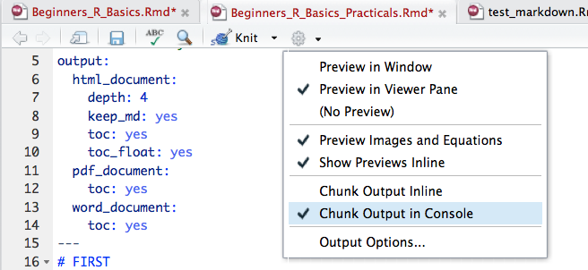
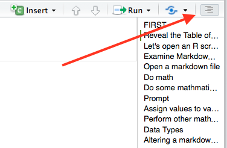

# FIRST

We need to alter how the output is displayed for this R markdown file. We want the output to be displayed in the console **NOT** within the R markdown file.      

To change this:

    Click on the Gear Icon > Select "Chunk Output in Console" 
 


# Reveal the Table of Contents 

This practical has a table of contents created using the **#**. Creating headers in Markdown will automatically created a Table of Contents.      

To access this: press the dashed line button on the upper right corner of the markdown file.



# Let's open an R script now

Open a new R script

    Go to File > New File > R script     
    
# Examine Markdown HTML file and Rmd to compare

Open *Beginners_R_Basics.Rmd* and compare it to *Beginners_R_Basics.html*       


# Open a markdown file

To open a new Markdown file:

    Go to File > New File > R Markdown...     
    
# Do math
Very basic use of R is getting R to perform mathematical operations. 

Click the green arrow on the right hand side to run this code in the practical markdown.  
```{r}
2 + 2
```

```{r}
5 - 3 + 2 * 4^2
```

```{r}
11465 * 2358971436
```

```{r}
options(scipen = 999)
11465 * 2358971436
```
What is the difference between these last two runs?    
**What do you think *options(scipen = 999)* is doing?**      

# Do some mathmatical operations in R     

1. What is 2 to the power 16?

```{r}

```

2. How many seconds are in a day?

```{r}

```

3. What is 150 pounds in kilograms? (1 kg = 2.20462 pounds)

```{r}

```

# Prompt
Click the green arrow on the right hand side to run this code in the practical markdown.       
```{r, eval = FALSE}
5 - 3 + 2 * 4^
```

Click the green arrow on the right hand side to run this code in the practical markdown. 
```{r, eval = FALSE}
(4 * (5 - (3 + 1))
```


# Assign values to variables     

Create a list of different animals (barnyard and household animals) each with a different value. Create at least 7 variables. 

```{r}
horses 
dogs

```


# Perform other mathematical operations with variables created

```{r}
farmyard <- horses + ...
farmyard
```

```{r}
household <- dogs + ...
household
```

1. Get the ratio of household to farmyard animals

```{r}

```

2. Get the difference between household and farmyard animals

```{r}

```

# Data Types 

```{r}
x <- 3
y <- "cars"

class(x)
class(y)

typeof(x)
typeof(y)
```

# Get help

1. What is the default option for whether a file has a header or not?    

# Install packages

1. Install and load the library for tidyverse package       

```{r}

```

2. Get and load the metaCCA package from Bioconductor     

```{r}

``` 

# Altering a markdown file  

1. Alter the options so that only the results are print in the output (no code).    

```{r}
x <- 75
y <- 238
z <- -21

(x * z) - y
```

*Knit* the HTML     

2. Alter the options so that only the code is printed (no results) in the output.     

```{r}
x <- 75
y <- 238
z <- -21

(x * z) - y
```

*Knit* the HTML   

3. Alter the options so that R does not evaluate the code.    

```{r}
x <- 75
y <- 238
z <- -21

(x * z) - y
```

*Knit* the HTML 

# Set working directory

Find out where you are:
```{r}
getwd()
```    

If you are not in BeginnersR_Materials_Day1 (this should be the last name in the path) when you run **getwd()**, then need to change our working directory using **setwd()**.     

```{r, eval = FALSE}
# MACS
#setwd("/")
    
# Windows
#setwd("c:/")
```   
Choose the appropriate one for your computer by **DELETING** the # in front of the command. Use tab completion to move to the  BeginnersR_Materials_Day1 folder on your computer.      

**REMEMBER** you are setting the working **directory** (folder) not pathing to a specific file.    


# Getting data into R   

You have been given 5 data sets to load into R.

All datasets are located in the data folder within BeginnersR_Materials_Day1.    

We will load 2 of them using RStudio's import functions, and then try to load 3 of them using the command line.     


1. Import mart_export.txt using the import function in RStudio and store as an object named genes.

Under **Import Options** (bottom left) change **Name** to genes


2. Import 13229_2017_124_MOESM4_ESM.xlsx using the import function in RStudio and store as an object named de_list. 
Skip the first 2 lines.   

Under **Import Options** (bottom left) change **Name** to de_list
Under **Import Options** (bottom left) change **Skip** to 2


3. Load life_expec.csv using read.csv() and store as an object named life_expec. 

```{r}

```
Ensure the data looks correct, by clicking on the name of the object (life_expec) in the Environment panel. This will open up the data to be viewed.     


4. Load U.S._Chronic_Disease_Indicators_CDI.xlsx using read_excel() and store as an object named US_CDI         

```{r}

```    
Ensure the data looks correct, by clicking on the name of the object (US_CDI) in the Environment panel. This will open up the data to be viewed.    


5. Load GSE62085_Non-normalized_data.txt and store as TCF4_KD    

```{r}

```
Ensure the data looks correct, by clicking on the name of the object (TCF4_KD) in the Environment panel. This will open up the data to be viewed.    

# Get data out of R    

Export the three loaded data sets out of R.  Unfortunately this has to be scripted.    

1. Export life_expec as life_expec.txt using read.table()
Remember : File name is **ALWAYS** surrounded by quotes.     
```{r}

```

2. Export US_CDI as US_CDI.csv using read.csv()
Remember : File name is **ALWAYS** surrounded by quotes.     
```{r}

```


3. Export de_list as de_list.txt using read.table()
Remember : File name is **ALWAYS** surrounded by quotes.     
```{r}

```

# Vectors

## Indexing vectors

```{r}
character_vector <- c("Harry Potter", "Ron Weasley", "Hermione Granger", "Neville Longbottom")
```

```{r}
character_vector[1]
```

```{r}
character_vector[3]
```

```{r}
character_vector[1:3]
```

```{r}
character_vector[c(1,3)]
```


## Complex indexing of vectors

```{r}
money_earned <- c(36,125,76,251,22)
```

Find out which values are greater than 100.
```{r}
money_earned > 100
```

Extract out just the days where money is great than 100 and save those values as a new factor called good_days
```{r}
good_days <- money_earned[money_earned > 100]
good_days
```

## %in% 

%in% corresponds to the match function 
```{r, eval = FALSE}
top10 <- c("Noah", "Liam", "Mason", "Jacob", "William", "Ethan", "James", "Alexander", "Michael", "Benjamin")
Mstart <- c("Mason", "Michael")

M_names <- top10[top10 %in% Mstart]
```
%in% returns a logical vector if thers is a match or not.     

*top10 %in% Mstart* : returns a logical vector for if the match is there or not     
*top10[top10 %in% Mstart]* : subset the vector top10 to only include those values that are TRUE in top10 %in% Mstart     


## Data types

*How do we check what class or type of data it is?*      

```{r}
ex1 <- c(1, 2, "Fizz", 3, "Buzz") # character

ex2 <- c(7, 235, 34.5, TRUE) # numeric

ex3 <- c("work", FALSE, "if") # character

```


# Factors

```{r}
movie_ratings <- c("bad", "okay", "okay", "good", "amazing", "horrible", "bad", "amazing")
```

1. Convert movie_ratings to non-ordered factor vector and print to screen factor_movie_ratings

```{r}

```

2. Convert movie_ratings to ordered factor vector and print to screen factor_movie_ratings

```{r}

```

# Dataframe indexing    

```{r, results = "hide"}
iris[,2]
```

```{r, results = "hide"}
iris[4,]
```

```{r, results = "hide"}
iris[, c(1,3)]
```

```{r, results = "hide"}
iris[,"Species"]
```

```{r, results = "hide"}
iris$Species
```
