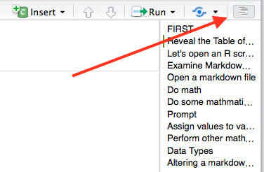
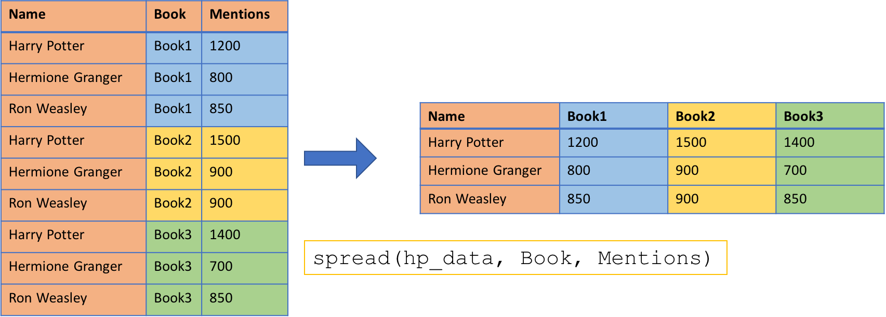

# SETUP

The data was sent to you before the course.   

Please **place this file on your desktop** and **unzip** it.

We are going to be working on **2** files. Please open:       

    1. Beginners_R_Data_Wrangling_Practicals.Rmd          
    2. Beginners_R_Data_Wrangling.html      

Beginners_R_Data_Wrangling.html is a *html file*, and should open in your default internet browser. 
    
Beginners_R_Data_Wrangling_Practicals.Rmd is a *R markdown file*, and should have opened up in RStudio.     

## Output in RStudio 

We need to alter how the output is displayed for *Beginners_R_Data_Wrangling_Practicals.Rmd* in RStudio.    

We want the output to be displayed in the console **NOT** within the R markdown file.      

To change this:

    Click on the Gear Icon > Select "Chunk Output in Console" 
 
  

## Reveal the Table of Contents 

 *Beginners_R_Data_Wrangling_Practicals.Rmd* has a table of contents created using the **#** which creates headers in Markdown.   

To access this: press the dashed line button on the upper right corner of the markdown file.



<br>

# Aim of the workshop	

* Basics of R
* R Markdown
* Importing/Exporting data
* Working with R packages
* Data wrangling using the tidyverse package
* Data visualization with ggplot2

# Learning Objectives
* Familiarity with dplyr package
* Perform data manipulations with dplyr
* Reshape data frames 
* Join data frames together

<br>

# Tidy data and tidyr
We will be working mainly with packages from [tidyverse](http://tidyverse.org/) to perform data manipulations and transformations. The tidyverse package is a package of packages, does not contain its own functions per se but includes a [variety of other packages](https://blog.rstudio.org/2016/09/15/tidyverse-1-0-0/), like [dplyr](http://dplyr.tidyverse.org/), [tidyr](http://tidyr.tidyverse.org/), [ggplot2](http://ggplot2.org/). Therefore by installing and loading the tidyverse package, we install and load all of these other packages as well.        

## Tidy data
[This](http://garrettgman.github.io/tidying/) is a good explanation of what tidy data is.      


What is "tidy" data?     

* Observations as rows    
* Variables as columns        
* One type of observational unit per table      
* Each value belongs to a variable and an observation         
* Column headers are variable names not variables    

## Understanding the structure of the data
Various functions exist to look at the data and give you basic information about it (like what type of data it is (numeric, character, etc.)).    

* head() -> prints to screen first few rows of data         
* tail() -> prints to screen last few rows of data        
* print() -> prints to screen data    
* class() -> class of data
* dim() -> how many rows and columns
* colnames() -> column names
* str() -> data preview, and column data types
* glimpse() -> similar to str(), dplyr function
* summary() -> summary of data

## PRACTICAL - Let’s examine the data

Let's first get a dataset to work on. Install and load the gapminder package in R. 

Access gapminder data by:
```{r, message = FALSE, warning = FALSE, eval = FALSE}
# remember you only have to install a package once
install.packages("gapminder")
library(gapminder)
head(gapminder)
```
```{}
library(gapminder)
head(gapminder)
```
This is:

    An excerpt of the data available at Gapminder.org. For each of 142 countries, the package provides values for life expectancy, GDP per capita, and population, every five years, from 1952 to 2007.

We also will need to load the tidyverse package as well.     
*We should have installed this package already you just need to load the library*

## PRACTICAL -  Examine the gapminder data

1. How many rows and columns are there?

``` 
```

2. What do the first few rows look like?

```
```

3. Does it have column names? What are they?

```
```

4. What type of data is in each column?

```
```

5. Examine the output from summary. What is this telling you about the data?

```
```

*Do not use print if you have a lot of data.*        
This will print all the rows and columns in the dataset to the screen and if you have a few thousand rows or columns it is really pointless.  

<br>

# Data Manipulation with dplyr

6 main “verbs” in dplyr

1. **select()** $\rightarrow$ select variables by name
2. **filter()** $\rightarrow$ return rows with matching conditions
3. **arrange()** $\rightarrow$ arrange rows by variables
4. **group_by()** $\rightarrow$ return grouping variables
5. **summarise()** $\rightarrow$ reduces multiple values down to a single value
6. **mutate()** $\rightarrow$ add new variables

<br>

## Select 
Select columns.     
Use select to keep or remove certain columns from a data sets.               

     

<br> 

```{r, eval = FALSE}
select(gapminder, country, year, lifeExp)

# vectorized
select(gapminder, country:year) # select all columns from country to year

# Not select a column
select(gapminder, -country) # select all columns BUT country
```

The select command in dplyr can be problematic as "select" is a function name used by lots of other packages.    

Therefore, depending on what packages you have loaded, you may get an error when using dplyr's select that does not make any sense.      

You can call the dplyr select function specifically using the following syntax:

```{r, eval = FALSE}
dplyr::select()
```
This tells R to use the dplyr select function specifically.   

<br> 

There are *LOADS* of helper functions that work with select, to make it easier to select multiple columns at once in larger data sets.            

* starts_with("Hap") -> ALL columns whose name starts with "Hap"        
* ends_with("ppy") -> ALL columns whose name ends with "ppy"          
* contains("app") -> ALL columns whose name contains "app"           
* matches("^(SNP|CHR)_") -> ALL columns who name match a regular expression         
* num_range("x", 1980:1983) -> ALL columns named x1980, x1981, x1982, and x1983        
* one_of(char_vector) -> ALL columns who name appears in character vector (char_vector)          

<br> 

### PRACTICAL -  select          

Using the **gapminder** dataset:    

1. Select country, year, and population columns from gapminder             

```
```

Using the **iris** dataset :    

2. Select all columns that contain the word Length      

```
```

3. Select all columns that contain the word Petal       

```
```

Using the **mtcars** dataset:         

4. Select all columns but disp and hp

```
```

5. Select columns mpg through to qsec, and gear

```
```

<br> 

## Filter          
Filter rows.    
Use filter to keep or remove certain rows from a data set. Use conditionals to keep only the rows that match the criteria.                

    

<br> 

```{r, eval = FALSE}
# single filter
filter(gapminder, year == 1997)

# multiple filters
filter(gapminder, year == 1997 & gdpPercap > 1000)
filter(gapminder, year == 1997 | year == 1967)
```

<br>  

Relational Operations |	Outputs TRUE or FALSE based on the validity of the statement…
----------------------|-----------------------------------------------------------------
a == b                |	a is equal to b
a != b	              | a is not equal to b
a > b	              | a is greater than b
a < b	              | a is less than b
a >= b	              | a is greater than or equal to b
a <= b	              | a is less than or equal to b
a %in% b              | a is an element in b

<br>  

Logical Operations | Outputs TRUE or FALSE based on the validity of the statement…
-------------------|-----------------------------------------------------------------
a & b, a && b      |	Both a and b are TRUE
a | b, a || b	   | Either a or b is TRUE.
!a	               | a is not TRUE (take everything else but a)
xor(a, b)	       | Either a or b is TRUE, but not both.
all(a,b,c,...)	   | a, b, c, … are all TRUE.
any(a,b,c,...)	   | Any one of a, b, c, … is TRUE.

The above tables were taken from [here](http://stat545.com/cm005-notes_and_exercises.html)

<br> 

### PRACTICAL -  filter         

Using the **gapminder** dataset:      

1. Keep only those rows with a life expectancy under 35    

```
```      

2. Keep only rows where continent is Americas or Europe.   
Strings (characters/words) must be surround in quotes.       

```
```

3. Keep only rows where country is Canada and the year is greater than 1983    

```
```  

4. Keep only rows where country is Canada or Australia and the year is before 1974  
    
```
```  

5. Keep only the rows where the year is greater than 1990, the continent is Europe and the gdpPercap is greater than 35000        

```
``` 

<br> 

## Arrange 
Arrange rows.   
Use to arrange rows by values (aka sort columns) in a dataset. Can do this either as ascending or descending.                  

      

<br> 

```{r, eval = FALSE}
# single parameter ascending arrange
arrange(gapminder, lifeExp)

# single parameter descending arrange
arrange(gapminder, desc(lifeExp))

# multiple parameter arrange
arrange(gapminder, desc(lifeExp), pop)
```
In a multiple parameter arrange, the order is important. In the example above, the gapminder data is first sorted by *desc(lifeExp)* (descending life expectancy) with any ties broken by value of *pop* (ascending population).         

<br> 

### PRACTICAL -  arrange 

Using the **gapminder** dataset:

1. Arrange the gapminder data by ascending year

```
```

2. Arrange the gapminder data by descending year

```
```

3. Arrange the gapminder data by descending country and ascending year

```
```

<br> 

## Group_by
Group by factor/category.    
Group together rows of data by some factor within the dataset.        
This command does very little on its own, but is very useful and powerful once combined with summarise. 

```{r, eval = FALSE}
# single variables
group_by(gapminder, continent)

# multiple variables
group_by(gapminder, country, continent)
```

<br> 

### PRACTICAL -  group

Using the **msleep** dataset:
    msleep is a mammals sleep dataset
    
1. Examine the first few lines of the msleep dataset     

```
```

2. Group by vore      

```
```

3. Group by order     

```
```

4. Group by vore and order    

```
```

*Does the output look different between the different datasets?*       

<br> 

## Summarise 
Summarize data.    
Create summary statistics from data sets.                

     


```{r, eval = FALSE}
# get mean of life expectancy
summarise(gapminder, mean_lifexp = mean(lifeExp))

# get mean of life expectancy and mean of GDP
summarise(gapminder, mean_lifexp = mean(lifeExp), mean_gdp = mean(gdpPercap))
```     

<br>

### Utilities
There is no need to rewrite a function that already exists in R, either in base R or in the vast amount of packages available for R. Built-in functions, those included with base R, are faster than re-writing them because they are actually written in C.     

Most of these built-in functions are related to stats, see [here](http://www.statmethods.net/management/functions.html) for more information. 

<br> 

Function | Description
---------|----------------------------
min()    | minimum
max()    | maximum
sum()    | sum
range()  | range
mean()   | mean 
median() | median
sd()     | standard deviation
var()    | variance 

<br> 


#### Missing and Utilities   
```{r, eval = FALSE}
summarise(airquality, mean_ozone = mean(Ozone))
```
**Why is this result occuring? What does the documentation about mean tell you?**   

If there is missing information, a lot of built-in statistical utilities will return *NA* instead of the expected result.     
This is due to the default parameters set for different options within the functions. *na.rm = FALSE* is the default for mean (and many other utilities), meaning that missing data is not removed, and therefore the operation can not perform its task because not all the information is there.     

To correct of this, the default needs to be over ridden.       

```{r, eval = FALSE}
summarise(airquality, mean_ozone = mean(Ozone, na.rm = TRUE))
```

<br>

### PRACTICAL -  summarise

Using the **gapminder** dataset:

1. Get the standard deviation (sd) for the population column

```
```

2. Get the median and standard deviation for gdpPercap

```
```

3. Get the minimum and maximum life expectancy. 

```
```

Using the **msleep** dataset:

4. Get the mean for sleep_total and awake     

```
```

5. Get the maximum and minimum brainwt     

```
```

*NOTE:* output is in table format, which can be saved as data frame. 

<br> 

## Mutate
Mutate existing columns to make new columns.     
Create new variables in a dataset using existing columns.          

    


```{r, eval = FALSE}
# single variables
mutate(gapminder, gdp_billion=gdpPercap*pop/10^9)

#  multiple variables
mutate(dataset1, rate = NUM1/100, norm = Value2 - 50)
```

<br> 

### PRACTICAL -  mutate

Using the **gapminder** dataset:

1. Create a new column called GDP which is population multiplied by gdpPercap

```
```

Using the **iris** dataset:       

2. Create two new columns:

* sepal area (sepal width times sepal length) 
* petal area (petal width times petal length)

```
```

Using the msleep dataset:

3. Create four new columns:

* weight_ratio (brainwt divided by bodywt)
* sleep_brain_ratio (brainwt divided by sleep_total)
* sleep_ratio (sleep_rem divided by sleep_total)
* awake_ratio (sleep_total divided by awake)

```
```

<br> 

## Pipe
dplyr allows for commands to be piped together using the **%>%** operator.     

This means take the output from the previous command as the input the next command.     

```{r, eval = FALSE}
gapminder %>%
    group_by(country) %>%
    summarise(mean_LE = mean(lifeExp))
```
*NOTE:* input data information for each command is now missing, and the subsequent "piped" commands are indented. The indentation makes it easier to follow the trail of commands within the pipe.      

When to not use a pipe:      

1. Multiple inputs or outputs                  
    + Pipes should focus on one clear task for one object       
2. More than 10 steps           
3. Directed graph structure              
    + Pipes are linear, they don’t loop back round!            

<br> 

### PRACTICAL -  pipe

Using the **gapminder** dataset:

1. Keep only the rows where year is 1982 and sort by  gdpPercap (descending)    

```
```

2. Keep only the rows where country is Canada, keep only the country, year and pop columns, and sort by population (ascending)    

```
```

3. Keep only the rows where year is 1982 and the continent is Europe. Sort by lifeExp (descending), and return only  country and lifeExp columns       

```
```

4. Sort the data by the minimum life expectancy for each country.      
Need to find the minimum life expectancy for each country (*HINT*: group_by and then summarize).

```
```

5. Get the average life expectancy by year, and sort for the longest life expectancy.   

```
```

6. For just countries in Africa, create a new variable called GDP which is population multiplied by gdpPercap, then get the average GDP by country and sort this be descending GDP      

```
```

**Challenge**     
7. How many distinct countries are in the file for each continent?        
*HINT:* Use [n_distinct](http://dplyr.tidyverse.org/reference/n_distinct.html)

```
```

**BIG challenge**     
8. Sort countries by their change in GDP from 1952 to 2007.      
*HINT:* These other dplyr commands may help [lead and lag](https://rdrr.io/cran/dplyr/man/lead-lag.html) and [n](https://www.rdocumentation.org/packages/dplyr/versions/0.5.0/topics/n).  

```
```

<br> 

# Reshape data
Wide data contains multiple columns for recurring entries, like year, day, book, etc. So one row will have multiple values for a single observation, separated by some factor.     

Long data contains one row for every observation.     

Depending on what type of statistics or plot you are making will determine which data format is most appropriate. 


      


<br>

To go from wide to long format:     
```{r, eval = FALSE}
gather(data, key, value, columns_info)

# Example
gather(hp_data, Book, Mentions, -Name)
```    

<br>

    

<br>

To go from long to wide format:     
```{r, eval = FALSE}
spread(data, key, value)

# Example
spread(hp_data, Book, Mentions)
```

<br> 

## PRACTICAL -  Reshape data     

1. From the data folder, load *big5_data_simple.csv* into R and save it as an object called **big5**

This data is information for about 20,000 people for the Big Five Personality Test. Data was downloaded (and modified slightly from [here](http://personality-testing.info/_rawdata/BIG5.zip))

Do this either using the import functionality in RStudio or scripting.         

```
```

2. Examine **big5**     
```
```

**What format is the data in?**     

3. Change the format of **big5** to have 3 columns, one for "People", one for the question on the questionnaire (the column names) called "Question", and one for the responses to those questions called "Response". Save as a new data frame called **big5_long**        
*REMINDER* the code format looks like this:      
```{r, eval = FALSE}
gather(data, key, value, columns_info)
```     

```
```

4. Reshape **big5_long** to back to wide format, and save as a new data frame called **big5_wide**.        
*REMINDER* the code format looks like this:          
```{r, eval = FALSE}
spread(data, key, value)
```     

```
```

The data should look like the original data now. *Does it?*

If you completely this quickly, **challenge** yourself to work with the unmodified version of the data (*big5_data_complex.csv*) and reshape the data to long format.       
<br> 

## PRACTICAL - Reshape take 2

1. From the data folder, load *people_behavior_measure.txt* into R and save it as a variable called **task1**.     

Do this either using the import functionality or by writing out the code.      

```
```

2. Examine **task1**   

```
```

3. Change the format of **task1** to have 3 columns only: People, Time, Value. Save as a new data frame called **task1_long**

```
```

Is there a way we could remove the excess NAs?      
How could I find out more about the options for the gather command?     
Where would I go for help or more information about my command?     

4. Remake **task1_long** but this time remove the excess NAs   

```
```

5. Reshape **task1_long** to back to wide format, and save as a new data frame called **task1_wide**. 
 
```
```

<br>   

There are other ways to reshape data in R. One way is to use the package [reshape2](https://cran.r-project.org/web/packages/reshape2/reshape2.pdf). [Melt](https://www.rdocumentation.org/packages/reshape2/versions/1.4.2/topics/melt) function performs the same task as gather, and [cast](https://www.rdocumentation.org/packages/reshape2/versions/1.4.2/topics/cast) performs the same task as spread. There is not a pro/con to which one you use, both will achieve the same result just using different approaches (and different command syntax) to get there.       

<br>

# Joining data    
Data sets must share at least one column with the same/similar information that you want to join them together on, called a **key**.    

This can be one or multiple columns, but most important is the the **key** or **keys** uniquely identify each row.    

If not, and there are multiple matches, all combination of the matches will occur.

There are a variety of different joins.   

     

## Left join
Join dataset2 to dataset1 
```{r, eval = FALSE}
left_join(dataset1, dataset2, by = "key")
left_join(dataset1, dataset2, by = c("key1", "key2"))
```
Returns: 

* all rows from dataset1
* all columns from dataset1 and dataset2       

If a row exists only in dataset1, data is retained.   
If a row exists only in dataset2, data is *not* retained.     

## Right join
Does the exact opposite of a left_join.     

Join dataset1 to dataset2  
```{r, eval = FALSE}
right_join(dataset1, dataset2, by = "key")
right_join(dataset1, dataset2, by = c("key1", "key2"))
```
Returns:

* all rows from dataset2
* all columns from dataset1 and dataset2     

If a row exists only in dataset1, data is *not* retained.     
If a row exists only in dataset2, data is retained.       

## Inner join
```{r, eval = FALSE}
inner_join(dataset1, dataset2, by = "key")
```
Returns:  

* only rows that exist in dataset1 and dataset2          

## Full join
```{r, eval = FALSE}
full_join(dataset1, dataset2, by = "key")
```
Returns:

* all rows in dataset1 and dataset2       

## What if columns do not have the same name?

Tell the join exactly what two columns you want to merge together.  

```{r, eval = FALSE}
left_join(dataset1, dataset2, by=c("data1column" = "data2column")) 
```  

Join dataset1 to dataset2, by the column called "data1column" in dataset1 and the column called "data2column" in dataset2.    

Because it is a left join and we are merging dataset2 into dataset1, the column name after the merge will be "data1column".    

To match on multiple columns that do  not have the same name.     
```{r, eval = FALSE}
left_join(dataset1, dataset2, by=c("data1column1" = "data2column1", "data1column2" = "data2column2")) 
```

<br> 

## PRACTICAL -  Play with joins

We are going to work with the some data from Harry Potter. 

1. From the data folder, load in all the dataset that start with HP (there should be 4). 

```
```

2. Examine each HP data.    

```
```

3. Merge together HP_books and HP_houses, keeping only the rows from HP_books.      
What are your keys?

```
```

What do you think the error message means?     
Should we be concerned?      

4. What happens if we do not tell the command which columns to join on?      

```
```

5. What is the difference between doing a left_join between HP_books and HP_houses, and doing a right_join?      

```
```

6. Join together HP_deaths and HP_houses, keeping only the rows common to both data sets.      

```
```

7. Join together HP_actors and HP_houses, keep all the rows from both data sets.    

```
```

Did you get an error? If so, why?      

If you successfully merged, do you see any type of order in the merge?      
