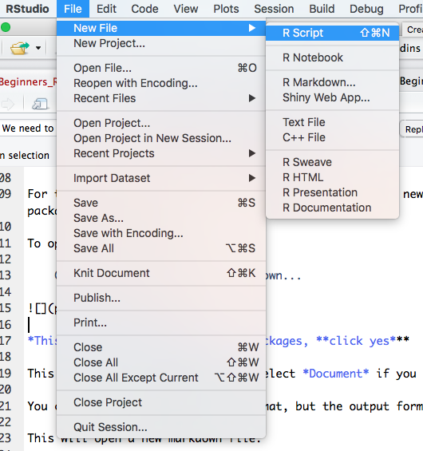
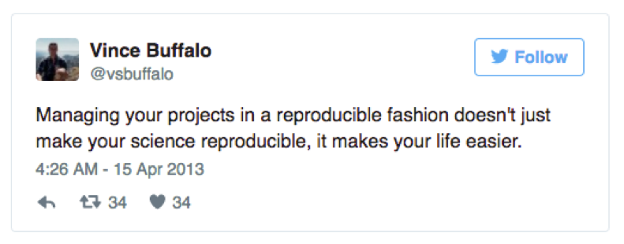
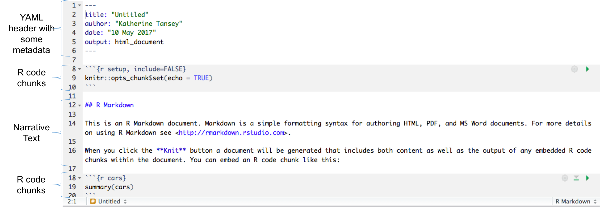
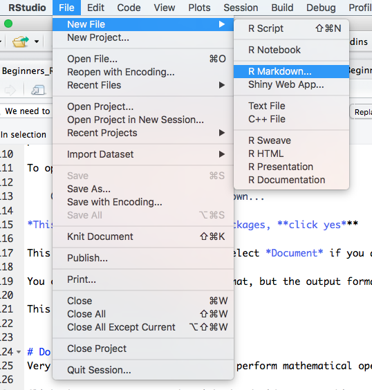
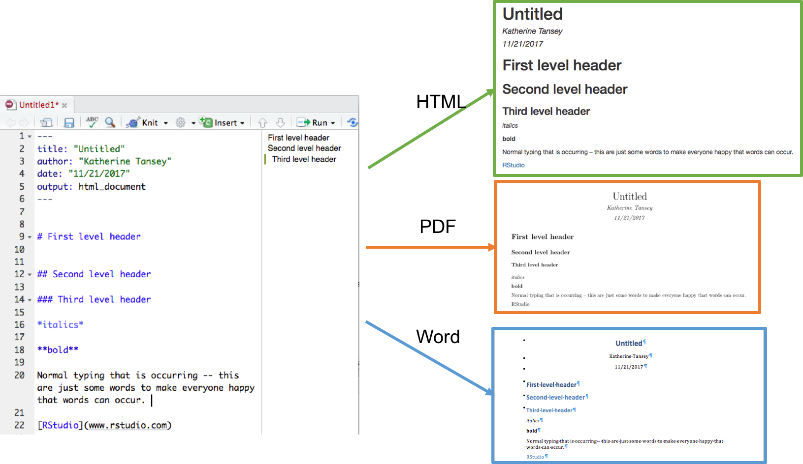
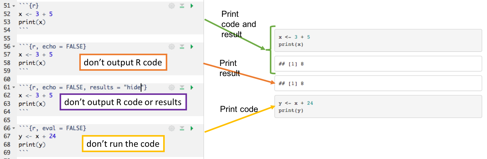

# Markdown

## Learning Objectives

* Get familiar and comfortable with Rmarkdown  
* Understand how to manipulate code chunks R
* Know the syntax/format for writing in Rmarkdown

<br>

# Reproducible research

You should **ALWAYS** write your code into a script that you save.

This will help avoid having to re-write code that you have already written, saving your self time and energy.

Helps make all the analyses you produce *reproducible*, which is **essential** for all scientific research.

It is worth noting that some journals have started to ask for code submission along side papers to make the data and results within publications as transparent as possible. Get into the habit now to write and save scripts.      

      

<br>

## PRACTICAL -  Let's open an R script now

Open a new R script

    Go to File > New File > R script     

    


# Project management
Good project management will ultimately make your life easier:     

* Help ensure data integrity
* Makes it simpler to share code 
* Easily upload code with manuscript submission
* Easier to pick the project back up after a break

     

<br>  

Best Practice for project management:     

* Treat data as read-only  
    + **Original data is always left in an untouched state**   
* Treat generated output as *disposable*
    + **All outputs should be able to be regenerated from scripts**
* Separate function definition and application
    + Reusable chunks get pulled into their own functions
    + Separate these into separate folders
        + Useful functions reused across analyses and projects
        + Analysis scripts

These are some tips for creating a folder structure of different projects. This is flexible, work with a structure that best suits your working style.      

The important point is to *have an organized structure*.    

* Put each project in its own directory that is named after the project
* Text documents associated with the project in the doc directory
* Raw data and metadata in the input directory
* Files generated during cleanup and analysis in an output directory
* Source for the project’s scripts and programs in the src directory
* Programs brought in from elsewhere or compiled locally in the bin directory
* **Name all files to reflect their content or function**       

     


<br>
      
**Do not use spaces, quotes, special characters, or wildcard characters such as * or ? in filenames, as it complicates variable expansion. **      

Give files consistent names that make logical sense, reflect what the data is and that are easy to match with wildcard patterns to make it easy to select them for looping.      

<br>

# Why use Markdown?
Supplement R code with narration so that in the future it is easier to understand why decisions were made and what the thought process was.        

It also allows for integration of UNIX (Bash), Python, SQL, and more.            

Make publishable reports in various formats (HTML, PDF, Word, Slideshows). 

The practical has been written in Markdown using R.    

The .Rmd file can be opened in RStudio, to work on the practical or add in additional text/information as notes. 

See [here](http://www.rstudio.com/wp-content/uploads/2015/03/rmarkdown-reference.pdf) for reference guide, and [here](http://rmarkdown.rstudio.com/lesson-15.html) for a cheat sheet.     

<br>     




## PRACTICAL - Examine Markdown HTML file and Rmd to compare

Open *Beginners_R_Markdown.html* and compare it to *Beginners_R_Markdown.Rmd*       

<br>


# Open a markdown file

To open a new Markdown file:

    Go to File > New File > R Markdown...     

      


This will open a dialogue window, select *Document* if you are making a Markdown script and give it a title.      

You can select a default output format, but the output format can always alter the output format afterwards.     

This will open a new markdown file.    

<br>

We will be working within R markdown files for the course. The course materials are written in R markdown files, and the practicals will be done within R markdown.   

<br>

# Basics of Markdown language

R markdown uses a simple mark up language.    

       


<br>

Headers are created using the # symbol.   
```{r, eval = FALSE}
# Header 1

## Header 2

### Header 3
```
On a MAC, the # is created by pressing ALT + 3. If you use a keyboard from another language, we might have to Google its location.  

Stars or underscores can be used to make words italic or bold. A single star or underscore on either side of a word makes it *italic*, double on either side makes it **bold**.              
```{r, eval = FALSE}
*italics* **bold**

_italics_ __bold__
```

 
Inserting links and pictures can be done using:    
```{r, eval = FALSE}
# Link
[click here](http://google.com)

# Picture


```    

Lists can be either ordered or unordered:       
```{r, eval = FALSE}
# Unordered List
* Stuff
* some more stuff
    + sub stuff
    + second sub stuff

# Ordered List
1. first
2. second
3. third
    + third part one
    + third part two
```     

To get a new line, you must finish a line with **two spaces**. A hard return will not create a new line.     

See [here](http://rmarkdown.rstudio.com/authoring_basics.html) for more basics. 

You can examine Beginners_R_Basic.Rmd for more examples of how to create tables, links, pictures, etc. using markdown language. It will show you how this HTML was created.   

## PRACTICAL -- Basic of Markdown

Perform the tasks below to alter this Markdown file. After completing these, Knit the markdown to an HTML and see what changes you have.       


Create a new first level header that says "Notes".          

Create an unnumbered list that is : Basics, Data Wrangling, Plotting, Markdown.          

Modify this practical list to be a numbered list (1, 2, 3 for the exercises listed).        

Add an image (Knit.png) from the pictures folder in BeginnersR_Materials.        

Change "click here" to include a link to Google.          


# Altering the output of code chunks   
Code chunks can be modified to alter the output. 

 

Rule                    | Example (default) | Function         
------------------------|-------------------|---------------------------------------------------------     
eval                    | eval=TRUE         | Is the code run and the results included in the output?      
include                 | include=TRUE	    | Are the code and the results included in the output?     
echo                    | echo=TRUE	        | Is the code displayed alongside the results?     
warning                 | warning=TRUE	    | Are warning messages displayed?     
error	                | error=FALSE	    | Are error messages displayed?      
message	                | message=TRUE	    | Are messages displayed?      
tidy	                | tidy=FALSE	    | Is the code reformatted to make it look “tidy”?     
results	                | results="markup"  | How are results treated? <br> "hide" = no results <br >"asis" = results without formatting      
cache	                | cache=FALSE	    | Are the results cached for future renders         
comment	                | comment="##"      | What character are comments prefaced with?      
fig.width, fig.height   | fig.width=7       | What width/height (in inches) are the plots?    
fig.align               | fig.align="left"  | "left" "right" "center"     

Table taken from [here](https://ourcodingclub.github.io/2016/11/24/rmarkdown-1.html)     

## PRACTICAL -- Altering a markdown file  

1. Copy that code chunk and alter the options so that only the results are print in the output (no code).    

```{r}
x <- 75
y <- 238
z <- -21

(x * z) - y
```


2. Copy that code chunk and alter the options so that only the code is printed (no results) in the output.     

```{r}
x <- 75
y <- 238
z <- -21

(x * z) - y
```


3. Copy that code chunk and alter the options so that R does not evaluate the code.    

```{r}
x <- 75
y <- 238
z <- -21

(x * z) - y
```


## PRACTICAL -- Plots and tables
Plots can be included using ggplot code without changes. 

4. Alter the code chunk below to not include the code, but output just the plot. Alter the size of the plot to something that looks good in the output (you might have to Knit, then alter, then Knit again until it looks as you want it to look).    
You may need to load the tidyverse package for the plot to make. 
```{r, eval = FALSE}
ggplot(mtcars, aes(x = mpg, y = hp)) +
    geom_point()
```

Tables in R markdown can be made using a package called [kable](http://rmarkdown.rstudio.com/lesson-7.html). To use kable, we need to install and load the "knitr" package.

5. Install and load the knitr package
You have to complete the code chunk below (by adding \{r\})    

```

```

6. Alter the code below to just output the results without showing the code. Use your knowledge about indexing dataframes (using square bracket notation) to only include the first 10 rows.    

```{r, eval = FALSE}
kable(mtcars)
```

# Customising R markdown files
There are lots of ways to customize a markdown file.     

Some simple things are to alter the YAML code at the top to include table of contents in the output.      

These would like this:

```{r, eval = FALSE}
---
title: "Beginners_R_Basics"
author: "Katherine Tansey"
date: "20 September 2017"
output:
  html_document:
    toc_depth: 4
    toc: yes
    toc_float: yes
---
```
The above YAML does: 

* **toc** adds a table of contents to the HTML output only       
* **toc_depth** is how far down with headers (header level four here) you want include in the table of contents         
* **toc_float** means the table of contents will move along the side of the HTML as the person scrolls through the page         

We have not specified anything for word or PDF outputs, just for HTML, so these options will only effect the formatting of the HTML output.     

For more options and customizing, see [here](http://rmarkdown.rstudio.com/html_document_format.html), [here](https://blog.rstudio.com/2016/03/21/r-markdown-custom-formats/), and  [here](https://cran.r-project.org/web/packages/prettydoc/vignettes/architect.html).    

<br>   

## PRACTICAL - Customising a Markdown file

Alter the top of this file to include a table of of contents for both html and word document outputs. 

Knit the document as an HTML and as a word document.    
