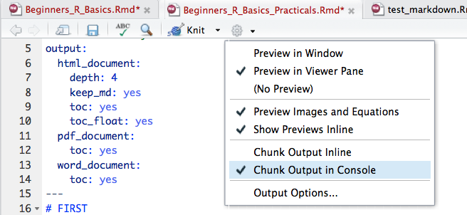

# SETUP

The data was sent to you before the course.   

Please **place this file on your desktop** and **unzip** it.

We are going to be working on **2** files. Please open:       

    1. Beginners_R_Plotting_Practicals.Rmd          
    2. Beginners_R_Plotting.html      

Beginners_R_Plotting.html is a *html file*, and should open in your default internet browser. 
    
Beginners_R_Plotting_Practicals.Rmd is a *R markdown file*, and should have opened up in RStudio.     

## Output in RStudio 

We need to alter how the output is displayed for *Beginners_R_Plotting_Practicals.Rmd* in RStudio.    

We want the output to be displayed in the console **NOT** within the R markdown file.      

To change this:

    Click on the Gear Icon > Select "Chunk Output in Console" 
 
  

## Reveal the Table of Contents 

 *Beginners_R_Plotting_Practicals.Rmd* has a table of contents created using the **#** which creates headers in Markdown.   

To access this: press the dashed line button on the upper right corner of the markdown file.


<br>

# Aim of the workshop	

* Basics of R
* R Markdown
* Importing/Exporting data
* Working with R packages
* Data wrangling using the tidyverse package
* Data visualization with ggplot2

# Learning Objectives

* Comprehend why plotting data is important
* Get familiar with the syntax of ggplot2 R package
* Understand which plot type to create arises from the data
* Integrate regression lines into plots to show data trends
* Learn how to manipulate the scales of plots
* Understand how to modify the plot layout
* Know how human perception changes interpretation of graphics 

<br>

# ALWAYS LOOK AT YOUR DATA!!!

Classic example called "Ancombe's Quartet", contains four data sets with nearly the **same exact statistics**:   

* mean of x    
* mean of y      
* variance of x     
* variance of y      
* correlation between x and y     
* linear regression line      
* coefficient of determination         

However when the data is visualized the true differences between the data sets are revealed.         


<br>

# Grammar of graphics
[ggplot2](http://vita.had.co.nz/papers/layered-grammar.pdf) package implements the ethos of the Leland Wilkinson's book  published in 1999.  **Works on idea of layers**, where things can be constantly added to the plot by adding another layer.

* Aesthetics -> what to plot    
* Geometries -> what type of plot to make     
* Facets -> multiple plots 
* Statistics -> regression lines, etc.
* Coordinates -> space data is plotted on   
* Themes -> everything else   

General command format for ggplot2:
```{r, eval = FALSE}
library(ggplot2)

ggplot(data = mtcars) +
	geom_point(mapping = aes(x=mpg, y=hp))
```     

* First line sets up what is going to be plotted
    + Data is from mtcars
    + There is no information about WHAT to do with this
* Second line informs what type of plot (geometry) to make
    + X-axis is mpg (miles per gallon)
    + Y-axis is hp (horsepower)
* Lines are linked together by + 

```{r, echo = FALSE}
library(ggplot2)

ggplot(data = mtcars) +
	geom_point(mapping = aes(x=mpg, y=hp))
```      

**OR**      

```{r, eval = FALSE}
ggplot(data = mtcars, mapping = aes(x=mpg, y=hp)) +
	geom_point()
```

* First line sets up what is going to be plotted
    + Data is from mtcars
    + X-axis is mpg (miles per gallon)
    + Y-axis is hp (horsepower)
    + There is no information about WHAT to do with this
* Second line informs what type of plot (geometry) to make
* Lines are linked together by + 

```{r, echo = FALSE}
ggplot(data = mtcars, mapping = aes(x=mpg, y=hp)) +
	geom_point()
```    

**Both of these syntaxes are fine**

> Let's make a plot 

First, we would need to load the *ggplot2* library. However, if we have loaded the *tidyverse* library, then *ggplot2* is already loaded. 

This is because *tidyverse* package is a package of packages, does not contain its own functions per se but includes a [variety of other packages](https://blog.rstudio.org/2016/09/15/tidyverse-1-0-0/), like [dplyr](http://dplyr.tidyverse.org/), [tidyr](http://tidyr.tidyverse.org/), [ggplot2](http://ggplot2.org/). Therefore by installing and loading the *tidyverse* package, we install and load all of these other packages as well.  

<br>

Using the diamonds dataset:

1. Examine the diamonds dataset

```
```

2. Make a scatter plot using any two *numeric* columns in the diamonds dataset.      
*HINT* [dbl and int](http://uc-r.github.io/integer_double/) are indicators of numeric columns       
*REMEMBER* basic syntax for a scatter plot in ggplot is this:

```{r, eval = FALSE}
ggplot(data = mtcars, mapping = aes(x=mpg, y=hp)) +
	geom_point()
```

```
```

3. What happens if you do not include *data = * or *mapping = *?

```
```

4. What happens if you do not include the line starting with geom (just run the first line)?

```
```

<br>

# Data
Preferable to start with a clean tidy dataset.     

Getting the data into the correct format for making a plot is sometime the biggest challenge of data visualization.    

Think about what you want the plot to look like (what variables being plotted to which aesthetics), and then work to format the data to achieve that visualization.           

<br>

There are two different types of reasons to create a plot:      

1. **Exploratory Data Analysis**         
    + Making plots for YOURSELF to get to know the data            
2. **Explanatory Data Analysis**          
    + Making plots for AUDIENCE to communicate insights about the data      

<br>

Think about what your visualization is communicating.      

* Is it easy to interpret?       
* Is it clear the message?       
* Is it easy to extract out is meaningful?      
* What information is actually getting across to the reader?              

  

<br>

# Aesthetics
In ggplot terminology, aesthetics refers to the data/variable linked to an attribute.    

Attributes are: 

* X-axis
* Y-axis
* [Color](http://bc.bojanorama.pl/wp-content/uploads/2013/04/rcolorsheet.pdf)
* [Line type](http://www.cookbook-r.com/Graphs/Shapes_and_line_types/)
* [Shape](http://www.cookbook-r.com/Graphs/Shapes_and_line_types/)
* Text
* Size 

**Aesthetic link to variables must be within aes()**
```{r}
ggplot(diamonds, aes(x = carat, y = price, color = clarity )) +
	 geom_point()
```

**If not linked to a variable, aesthetic applied to every point equally, it is an attribute**
```{r}
ggplot(diamonds, aes(x = carat, y = price)) +
	 geom_point(color = "blue")
```

Not all aesthetics are available for all plot types (geometries) (for instance, y axis for histograms).     

Check the documentation for geoms [here](http://ggplot2.tidyverse.org/reference/).    

> Play around with attributes and aesthetics 

Using the diamonds dataset:    

1. Remake the scatter plot you made above, but assign a *non-numeric* variable to **color**.    

```
```

2. Remake the scatter plot above, but now assign a *non-numeric* variable to **shape** and set the **color** of all points to be red.     

```
```

3. Remake the scatter plot above, but now assign a *numeric* variable to **size** and a *non-numeric* variable to **color**. Change the **shape** of all the points to be a filled-in square (shape = 15).     

```
```

4. Remake the scatter plot above.
What happens if you set **color** as an aesthetic (assign a *non-numeric* variable to color) *AND* set a **color** (red) for all points in the geom_point command?

```
```

Why do you think this is happening?   

<br>

# Geometries 
The type of plot used to visualize data depends on the type of data being plotted. Not all graphs are appropriate for all data types.       

    

<br>

ggplot2 offers a wide variety of different plot types, referred to as *geoms*.           

      

<br>

## One Variable -- Continuous 
A histogram or a density plot are the most common for a single continuous variable trait.      

     

<br>

To make a histogram in ggplot2, we use the **geom_histogram()** command.   

```{r, eval = FALSE}
ggplot(diamonds, aes(x = price)) +
    geom_histogram() 
```     
[See here](http://ggplot2.tidyverse.org/reference/geom_histogram.html) for more information about options in geom_histogram.    

<br>

To make a density plot in ggplot2, we use the **geom_density()** command.  

```{r, eval = FALSE}
ggplot(diamonds, aes(x = price)) +
    geom_density()
```     
[See here](http://ggplot2.tidyverse.org/reference/geom_density.html) for more information about options in geom_density.       

<br>

> Let’s play around with making plots

Using the diamonds dataset:

1. Make a histogram of the carat variable.

```
```

2. Experiment with binwidth.     
Add *binwidth = #* in the parentheses for *geom_histogram*. Play around with the number (#).   

```
```

What is binwidth doing?   
Does the plot and interpretation become different as you alter the binwidth?  

3. Change the histogram to a density plot.   

```
```

4. Alter the density plot code above to add an aesthetic for **color** to be the variable clarity (color = color). 

```
```

5. Alter the density plot code above, but change the word color to **fill**. 

```
```

6. Does the **color** and **fill** variables work the same for *geom_histogram*?       
Try it out.

```
```

<br>

## One Variable --Discrete
A bar plot is the most common for a single discrete variable trait.     
      


Do not use bar plots to plot DISTRIBUTIONS, instead plot the individual data points or think about using another type of plot type like box, violin or just visual error bars. [This is a very good blog post about why not to use bar plots for this purpose](http://www.eckmeier.de/?p=110)        

<br>

To make a bar chart in ggplot2, we use the **geom_bar()** command.  

```{r, eval = FALSE}
ggplot(diamonds, aes(x = cut)) +
    geom_bar()
```     
[See here](http://ggplot2.tidyverse.org/reference/geom_bar.html) for more information about options in geom_bar.        

<br>

> Let’s play around with making plots

Make a bar chart using the diamonds dataset. Select a *non-numeric* variable to chart.    

```
``` 

<br>

## Two Variable -- Both continuous 
    
<br>

To make a scatter plot in ggplot2, we use the **geom_point()** command.  

```{r, eval = FALSE}
ggplot(mtcars, aes(x = mpg, y = wt)) +
    geom_point()
```     
[See here](http://ggplot2.tidyverse.org/reference/geom_point.html) for more information about options in geom_point.            

<br>

To make a jitter plot in ggplot2, we use the **geom_jitter()** command.   

```{r, eval = FALSE}
ggplot(mtcars, aes(x = mpg, y = wt)) +
    geom_jitter()
```     
geom_jitter creates a scatter plot but "adds a small amount of random variation to the location of each point, and is a useful way of handling over plotting caused by discreteness in smaller data sets."    

[See here](http://ggplot2.tidyverse.org/reference/geom_jitter.html) for more information about options in geom_jitter.            

<br>

To make a plot with a smoothing line in ggplot2, we use the **geom_smooth()** command. 

```{r, eval = FALSE}
ggplot(mtcars, aes(x = mpg, y = wt)) +
    geom_smooth()
```     
geom_smooth adds a smoothing line to the plot, and there are various different statistical models that can be used to create this line.   
[See here](http://ggplot2.tidyverse.org/reference/geom_smooth.html) for more information about options in geom_smooth.               

<br>


To make a scatter plot that use the variable text instead of points in ggplot2, we use the **geom_text()** command.   

```{r, eval = FALSE}
ggplot(mtcars, aes(x = mpg, y = wt, label = cyl)) +
    geom_text()
```     
The label aesthetic **must** be specified in geom_text.   
[See here](http://ggplot2.tidyverse.org/reference/geom_text.html) for more information about options in geom_text.                  

<br>

To make a scatter plot in ggplot2 with a straight diagonal line, we use the **geom_abline()** command.      

```{r, eval = FALSE}
ggplot(mtcars, aes(x = mpg, y = wt)) +
    geom_point() +
    geom_abline(slope = -0.1409 , intercept = 6.0473)
```     
*NOTE:* We are plotting **two geoms** on the same plot.    
[See here](http://ggplot2.tidyverse.org/reference/geom_abline.html) for more information about options in geom_abline.               

<br>

To make a scatter plot in ggplot2 with a vertical and horizontal line, we use the **geom_hline()** (horizontal line) or **geom_vline** (vertical line) command.      

```{r, eval = FALSE}
ggplot(mtcars, aes(x = mpg, y = wt)) +
    geom_point() +
    geom_vline(xintercept = 30) +
    geom_hline(yintercept = 3)
```     
*NOTE:* We are plotting **three geoms** on the same plot.    
[See here](http://ggplot2.tidyverse.org/reference/geom_abline.html) for more information about options in geom_hline or geom_vline.                 

<br>

> Let’s play around with making plots

Using the gapminder data:          

1. Make a scatter plot of life expectancy by GDP

```
``` 

2. Alter the plot above to use the log of GDP (*log(gdpPercap)*).      
[See here](http://astrostatistics.psu.edu/su07/R/html/base/html/Log.html) for how to take log of a variable      

```
``` 

3. Alter the plot above to **color** the points by continent

```
``` 

4. Alter the plot above to change the **size** of the points by the population

```
```

5. There are a lot of points on the plot, so let's clean up the plot a bit and just focus on one single year, the latest year in the data 2007.   

Using dplyr:     
We can filter the data to only include rows where year is 2007. We can do this two ways:   
    1. Filter gapminder data within the ggplot2 command    
    2. Filter the gapminder data and save the out as a new data frame, then read this data frame in as the data for ggplot2 command    
 
```
``` 

6. Turn off legends.   
[See here](http://www.cookbook-r.com/Graphs/Legends_(ggplot2)/) for more information about altering legends. Adding *theme(legend.position="none")* as a new line will remove the legend.   
**REMEMBER** lines have to be connected by a +     

```
``` 

7. Add to the plot a line of best fit.  
ggplot2 allows for multiple similar geoms to be plotted onto the same plotting window (remember the idea of layering).  
Like above, you add a new layer to the plot but using the **+** and adding the additional geoms/layers.         
We want to run a linear smooth model (*method = "lm"*) and turn off the se (*se = FALSE*), so add this code to the plot *geom_smooth(method = "lm", se = FALSE)* 

```
```

geom_smooth is creating a line for *every* continent, why do you think this is?    
Think about how inheritance of the aesthetics works.     

We want to look at a single line, a *global trend* rather than continental trends.      
Each geom can have their own local aesthetic set. If we move **color** and **size** from the top line into geom_point as aesthetics, we will now plot the global trend line with geom_smooth.   

The code for geom_point should now look like this: *geom_point(aes(color = continent, size = pop))*      
Try to alter the code to create this.       

```
``` 

<br>

## Over plotting    
Over plotting occurs when there are too many data points. It then becomes hard to see any information about density of data when all points are solid black dots.     

Information about the data becomes less clear with more data points.         

     


These plots were created using this code.    
```{r, eval = FALSE}
library(car)

ggplot(Vocab, aes(x=education, y = vocabulary)) +
    geom_point()

ggplot(Vocab, aes(x=education, y = vocabulary)) +
    geom_jitter(alpha = 0.2, shape = 1, size = 1)
```

Over plotting is a huge issue when working with large data sets, but there are few things that you can do to attempt to minimize its effect.

1. Size  
    + Smaller points are easier to see
2. Shape  
    + Hollow circles objects are better
3. Jitter  
    + Adds random noise to x and y axis point
    + Makes it easier to see points that overlay
4. Alpha  
    + Alters the transparency
    + Allows you to see density

<br>

> Attempt to fix overplotting

Using the gapminder data:

1. Remake the scatter plot of life expectancy by GDP using all the gapminder data.       

```
```

2. Change geom_point to geom_jitter.   
Within the geom_jitter command, include arguments for alpha (*alpha = #*). 

```
```   

*What do you think the alpha option is doing?*    

3. Change the above code to include **shape** with geom_jitter. Change the shape to a hollow circle (shape = 1).    

```
```

<br>

## Two Variable -- Continuous and Time
    

<br>

To make a line plot in ggplot2, we use the **geom_line()** command.  

```{r, eval = FALSE}
USPersonalExpenditure <- as.data.frame(USPersonalExpenditure)

# To make this plot I need to alter the format of the data
USPersonalExpenditure_long <- USPersonalExpenditure %>%
    rownames_to_column(var="Expense") %>%
    gather(key = year, value = amount, -Expense)

ggplot(USPersonalExpenditure_long) +
    geom_line(mapping = aes(x=year, y = amount, group = Expense))
```     
[See here](http://ggplot2.tidyverse.org/reference/geom_path.html) for more information about options in geom_line.    

[rownames_to_column](http://tibble.tidyverse.org/reference/rownames.html) convert rownames to a columns within a data frame.       

<br>

> Let’s play around with making plots

Use the gapminder data:

1. Create a plot showing the change in population over time for the United Kingdom.     
We need to filter the dataset to just include the country United Kingdom. Like above there are two ways to do this:
    1. Filter gapminder data within the ggplot2 command   
    2. Filter the gapminder data and save the out as a new data frame, then read this data frame in as the data for ggplot2 command    
    
```
``` 

2. If you wanted to compare the UK change in population to France, how could you do that? 

```
```

<br>

## Two Variable -- Discrete and Continuous 
      
To make a box plot in ggplot2, we use the **geom_boxplot()** command.  

```{r, eval = FALSE}
ggplot(mtcars, aes(x = factor(cyl), y=wt )) + 
    geom_boxplot()
```     
[See here](http://ggplot2.tidyverse.org/reference/geom_boxplot.html) for more information about options in geom_box plot.       

<br>

To make a violin plot in ggplot2, we use the **geom_violin()** command.  

```{r, eval = FALSE}
ggplot(mtcars, aes(x = factor(cyl), y=wt )) + 
    geom_violin()
```     
[See here](http://ggplot2.tidyverse.org/reference/geom_violin.html) for more information about options in geom_violin.          

<br>


> Let’s play around with making plots

Using gapminder dataset:

1. Make a box plot of life expectancy by continent.  
*continent* need to wrapped in the command *as.factor()*, as was done in the example code above.     

```
``` 
*What does a box in the plot indicate?*

2. Using the above plot, add points for each data point to the plot. 
*Should we be using some overplotting reduction techniques?* 

```
``` 

You can tell jitter a range to jitter within, [see here](http://ggplot2.tidyverse.org/reference/position_jitter.html). Adding position information to the geom_jitter command can alter the spread of the points.  

3. Add *position = position_jitter(width = 0.1, height = 0.1)* within the parentheses for geom_jitter to the plot made above, does this look nicer?

```
```

4. Change the above plot into a violin plot.   

```
``` 

*Which one do you think is more informative, the box plot or violin plot?*

<br>

# Facet
Split up a large complex plot into multiple smaller plots by creating a separate plot for each category of a categorical (or discrete) variable. 


       

<br>

To make a facet plot in ggplot2, we use the **facet_grid()** command.  

```{r, eval = FALSE}
ggplot(diamonds) + 
    geom_boxplot(mapping = aes(x = cut, y = price)) +
    facet_grid(color ~ clarity)
```     
[See here](http://ggplot2.tidyverse.org/reference/facet_grid.html) for more information about options in facet_grid.   
[See here](http://ggplot2.tidyverse.org/reference/facet_wrap.html) for more information about a similar command called facet_wrap.     


<br>

> Let’s play around with faceting plots

Using the gapminder data:

1. Make a box plot for life expectancy by year faceted for continent (make multiple plots in rows). 

```
``` 

2. Make the boxplot for life expectancy by continent faceted for continent (make multiple plots in rows).   

```
``` 

Using the diamonds data set:      

3. Make a scatter plot of price vs carat and facet it by cut.    
*REMEMBER* the over plotting techniques.    

```
```

<br>

# Coordinates
There are two different ways to alter the axis of a plot.     

The first is use [xlim and ylim](http://ggplot2.tidyverse.org/reference/lims.html) to alter the x or y axis.  

However, using these while plotting any statistics or smooth/regression lines will alter the line.   

To not alter plotting statistics, use [coord_cartesian](http://ggplot2.tidyverse.org/reference/coord_cartesian.html) instead. This will change the axis limits without altering statistic plot information.   

Furthermore, in general it is ideal to keep plots to aspect ratio of 1, however not always possible.  

> Alter axis

Using the mtcars dataset:

1. Make a scatter plot of mpg vs hp. Add a smoothing line (use the default settings).  

```
```

2. Using the plot above, alter the x axis using the command [xlim](http://ggplot2.tidyverse.org/reference/lims.html).      
xlim is another layer that is added to the plot and is included as its own line connected to the rest of the plot code by a **+**    
Change the x axis to range from 10 to 20

```
```

3. Alter the x axis using [coord_cartesian](http://ggplot2.tidyverse.org/reference/coord_cartesian.html) instead.    
Change the x-axis to range from 10 to 20.     
Because coord_cartesian takes both x and y axis information, you need to tell it which axis you want to alter. The code within the coord_cartesian command should look something like this : xlim=c(7.5,10)    (except we want different numbers!)

```
```

<br>

# Themes
Everything in ggplot2 can be altered. [Theme](http://ggplot2.tidyverse.org/reference/theme.html) refers to all the visual elements not part of the plot, like:

* Text
    + Axis title and text, Plot title, Legend title and text
* Lines
    + Axis ticks and lines, grid pattern
* Background
    + Plot, Legend, Panel

Absolutely everything can be modified.         

There is a hierarchy to the theme elements with a complex break down written [here](https://www.rdocumentation.org/packages/ggplot2/versions/1.0.1/topics/theme) about how inheritance between elements works.                

Useful starting point is to use a [set theme from ggplot2](http://ggplot2.tidyverse.org/reference/ggtheme.html) and then make minor changes to the set theme. This can reduce the number of changes/modifications that you have to make.          

There are also **A LOT** of [built in themes](http://ggplot2.tidyverse.org/reference/ggtheme.html). These can be really useful starting points, so that rather than tweak everything, you can use a built in theme and make minor changes from there.    


> Use built in themes

Using the gapminder data:

1. Remake a line plot for the population by year for the UK. 
*REMEMBER* need to filter the gapminder data for only the rows where country is the United Kingdom

```
```

2. Add *theme_bw()* to the plot.    
This is another layer being add, so the *theme_bw()* line of code is add to the plot with a **+** connecting it to the rest of the code.    

```
```

3. **Challenge**. Get the total population for each continent for each year, and the create a line plot showing the change in population for each continent over time. Change the theme to be theme_bw. 

```
```

<br>

# Things to think about when making plots
Humans read different information with differing levels of ease, and this should be taken into account when creating a graphic. Make it easy for your reader to be able to interpret the information.        

 


It is also worth making graphics color blind friendly. There are numerous palettes within R/ggplot2 that have been created to help. See [here](http://www.cookbook-r.com/Graphs/Colors_(ggplot2)/#a-colorblind-friendly-palette) for more information.      

 

In general, color should only be used for non-continuous traits. Color differentiation of saturation and value is difficult, and our perception of them is skewed by the colors around them. This makes it harder to accurately compare across graphs whether color is the same or different.       

  

Avoid using two different aesthetics to show the same information.       
     
**What is color telling us?**      

It is also worth making graphics color blind friendly. There are numerous palettes within R/ggplot2 that have been created to help. See [here](http://www.cookbook-r.com/Graphs/Colors_(ggplot2)/#a-colorblind-friendly-palette) for more information.      

   
